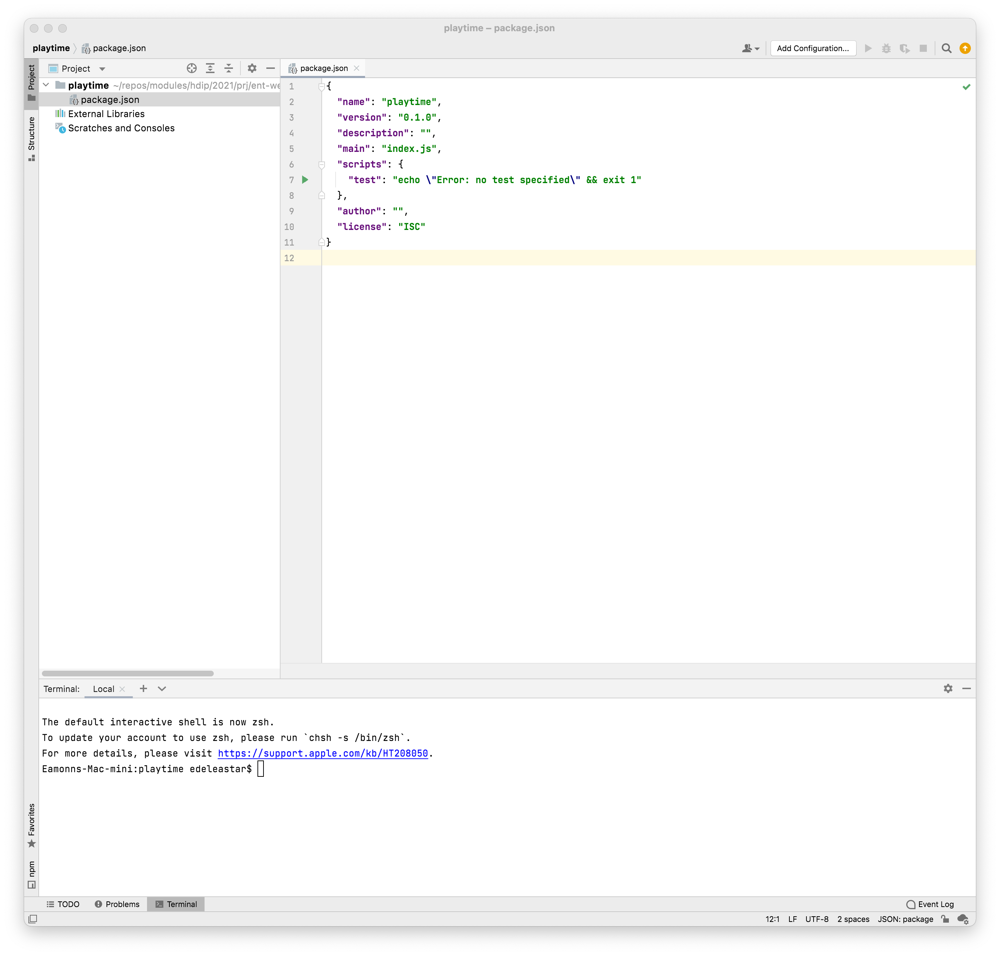

# Create Package.json

Make sure you have Node.js installed - selecting the LTS version:

- <https://nodejs.org/en/>

You can check the version installed:

~~~bash
node -v
~~~

It may report something like this:

~~~bash
v16.13.x
~~~

To start a project, create a folder - call it `playtime`, open a shell inside the new folder and enter:

~~~bash
npm init
~~~

This will launch a command line app, which will ask you a series of questions about the node app it will create:

~~~bash
This utility will walk you through creating a package.json file.
It only covers the most common items, and tries to guess sensible defaults.

See `npm help init` for definitive documentation on these fields
and exactly what they do.

Use `npm install <pkg>` afterwards to install a package and
save it as a dependency in the package.json file.

Press ^C at any time to quit.
package name: (playtime) playtime
version: (1.0.0) 0.1.0
description:
entry point: (index.js)
test command:
git repository:
keywords:
author:
license: (ISC)
About to write to /Users/edeleastar/repos/modules/hdip/2021/prj/ent-web/scratch/package.json:

{
  "name": "playtime",
  "version": "0.1.0",
  "description": "",
  "main": "index.js",
  "scripts": {
    "test": "echo \"Error: no test specified\" && exit 1"
  },
  "author": "",
  "license": "ISC"
}

Is this OK? (yes) y
~~~

In the above, we have entered the package name + version, and left the default (often blank) for all other prompts. The output of `npm init` app will be to generate this file:

## package.json

~~~json
{
  "name": "playtime",
  "version": "0.1.0",
  "description": "",
  "main": "index.js",
  "scripts": {
    "test": "echo \"Error: no test specified\" && exit 1"
  },
  "author": "",
  "license": "ISC"
}
~~~

Using either VSCode or WebStorm, open the folder containing the new app:

The app is defined just in a single file currently - `package.json`