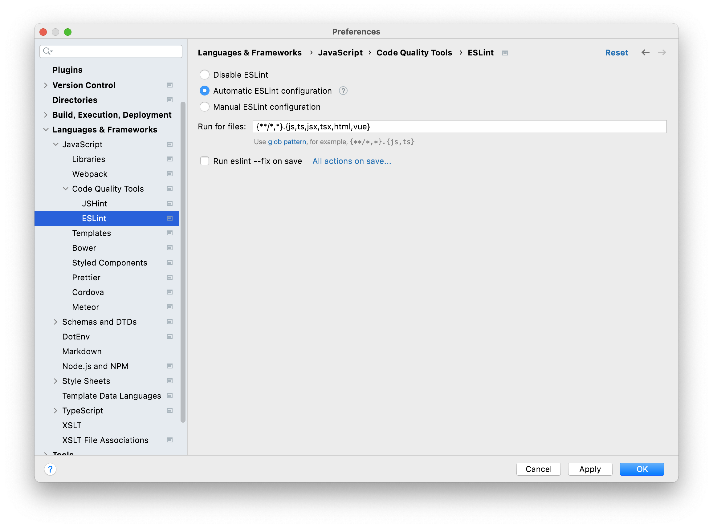
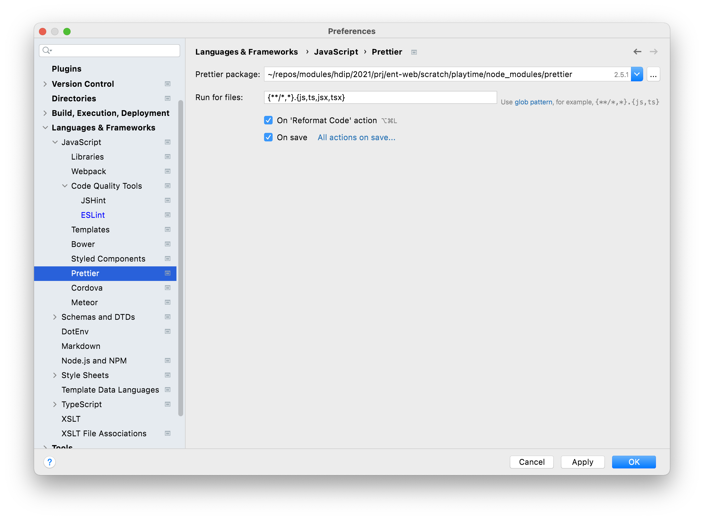
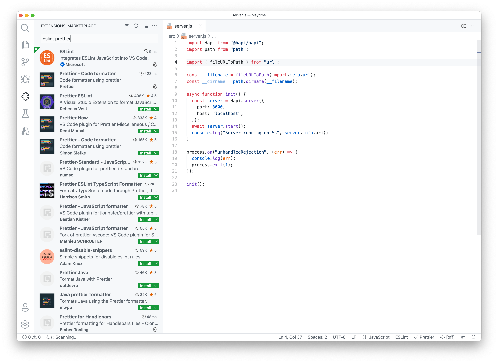

# Code Quality Tools

Before scaffolding up the core application features, we are going to install some key code quality tools:

ESLint enforces a range of configurable Javascript standards:

- <https://eslint.org/>

Prettier is an "opinionated" code formatter:

- https://prettier.io/

These are components we integrate into each of our projects, and also hook up to our IDE.

Both ESLint & prettier can be configured with specific styles - we will use the popular AirBnB style:

- <https://github.com/airbnb/javascript>

These are the commands to install these components in our app:

~~~bash
npm install -D eslint
npm install -D eslint-config-airbnb-base
npm install -D eslint-config-prettier
npm install -D eslint-plugin-import
npm install -D prettier
~~~

The above will install these packages to the `node_modules` folder, and extend `package.json` as follows:

## package.json

~~~json
{
  "name": "playtime",
  "version": "0.1.0",
  "description": "",
  "main": "index.js",
  "scripts": {
    "test": "echo \"Error: no test specified\" && exit 1"
  },
  "author": "",
  "license": "ISC",
  "devDependencies": {
    "eslint": "^8.4.1",
    "eslint-config-airbnb-base": "^15.0.0",
    "eslint-config-prettier": "^8.3.0",
    "eslint-plugin-import": "^2.25.3",
    "prettier": "^2.5.1"
  }
}
~~~

The `-D` option signifies that these are `developer` components, listed in a `devDependencies` section as shown.

ESLint is configured by an additional file in your project. Create this now:

## .eslintrc.json

~~~json
{
  "env": {
    "node": true,
    "es2021": true
  },
  "extends": [
    "airbnb-base",
    "prettier"
  ],
  "parserOptions": {
    "ecmaVersion": "latest",
    "sourceType": "module"
  },
  "rules": {
    "quotes": [
      "error",
      "double"
    ],
    "import/extensions": "off",
    "import/prefer-default-export": "off",
    "object-shorthand": "off",
    "no-unused-vars": "off",
    "no-underscore-dangle": "off",
    "no-param-reassign": "off",
    "no-undef": "off",
    "func-names": "off",
    "no-console": "off"
  }
}
~~~

In the above we customised some of the rules inherited from the airbnb style guide - tuning them to the specific needs/preferences of our application.

We configure prettier with this file:

## .prettierrc.json

~~~json
{
  "trailingComma": "es5",
  "tabWidth": 2,
  "semi": true,
  "singleQuote": false,
  "printWidth": 180
}
~~~

## IDE Config

If you are using WebStorm, then you will need to configure it to load ESlint + prettier settings from these files. Configure as shown below:

### WebStorm

If you are using VSCode, then you will need to install extensions for ESLint & Prettier extensions:

### VSCode

VSCode has many compatible extensions - in the above the top two listed are installed and should perform as expected.

Finally, the following `.gitignore` is a standard for node application, and should be included in your project to prevent generated files from populating git:

## .gitignore

~~~bash
# IDE
.idea
.vscode

# Logs
logs
*.log
npm-debug.log*
yarn-debug.log*
yarn-error.log*
lerna-debug.log*
.pnpm-debug.log*

# Diagnostic reports (https://nodejs.org/api/report.html)
report.[0-9]*.[0-9]*.[0-9]*.[0-9]*.json

# Runtime data
pids
*.pid
*.seed
*.pid.lock

# Directory for instrumented libs generated by jscoverage/JSCover
lib-cov

# Coverage directory used by tools like istanbul
coverage
*.lcov

# nyc test coverage
.nyc_output

# Grunt intermediate storage (https://gruntjs.com/creating-plugins#storing-task-files)
.grunt

# Bower dependency directory (https://bower.io/)
bower_components

# node-waf configuration
.lock-wscript

# Compiled binary addons (https://nodejs.org/api/addons.html)
build/Release

# Dependency directories
node_modules/
jspm_packages/

# Snowpack dependency directory (https://snowpack.dev/)
web_modules/

# TypeScript cache
*.tsbuildinfo

# Optional npm cache directory
.npm

# Optional eslint cache
.eslintcache

# Microbundle cache
.rpt2_cache/
.rts2_cache_cjs/
.rts2_cache_es/
.rts2_cache_umd/

# Optional REPL history
.node_repl_history

# Output of 'npm pack'
*.tgz

# Yarn Integrity file
.yarn-integrity

# dotenv environment variables file
.env
.env.test
.env.production

# parcel-bundler cache (https://parceljs.org/)
.cache
.parcel-cache

# Next.js build output
.next
out

# Nuxt.js build / generate output
.nuxt
dist

# Gatsby files
.cache/
# Comment in the public line in if your project uses Gatsby and not Next.js
# https://nextjs.org/blog/next-9-1#public-directory-support
# public

# vuepress build output
.vuepress/dist

# Serverless directories
.serverless/

# FuseBox cache
.fusebox/

# DynamoDB Local files
.dynamodb/

# TernJS port file
.tern-port

# Stores VSCode versions used for testing VSCode extensions
.vscode-test

# yarn v2
.yarn/cache
.yarn/unplugged
.yarn/build-state.yml
.yarn/install-state.gz
.pnp.*
~~~

