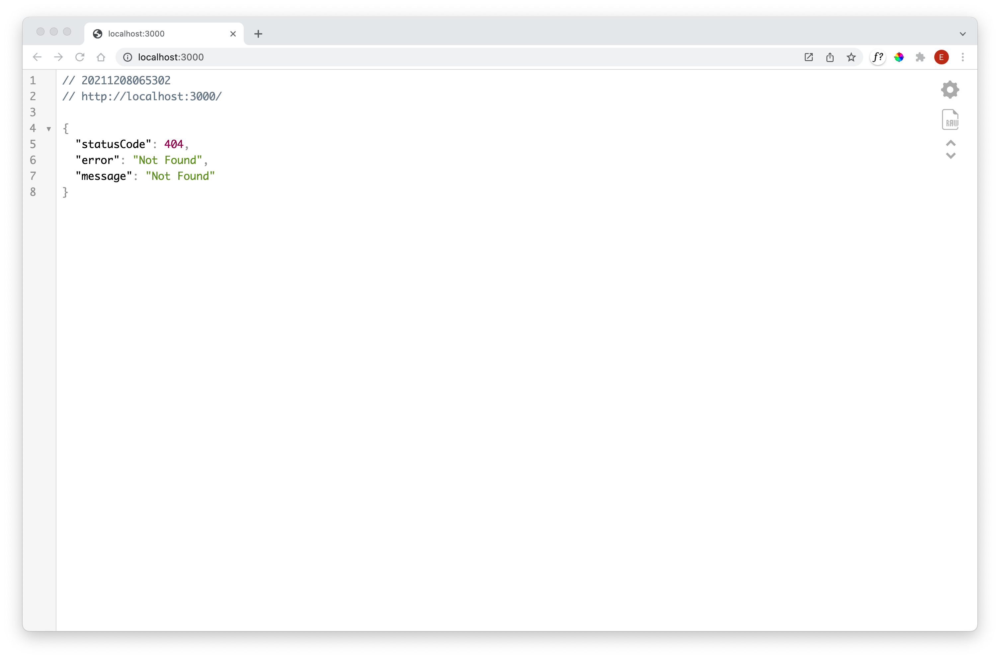
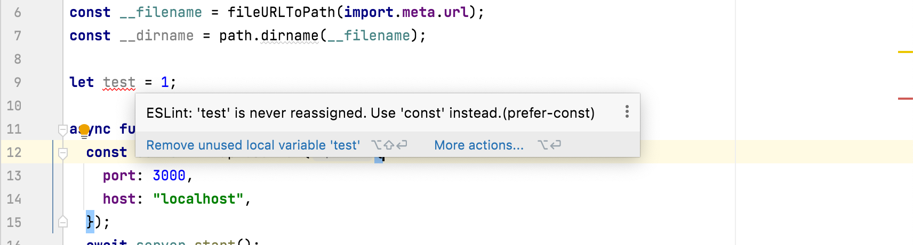
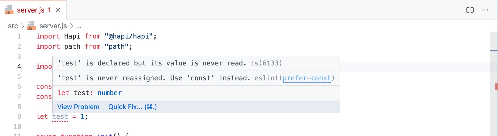

# Server

With this code quality enforcement in place, we can now start to build the application. If we stray outside the ESLint/Prettier settings we will expect our IDE to alert us in the editor and/or automatically autocorrect.

Install the following component in our application by running this command (inside the project folder):

~~~bash
npm install @hapi/hapi
~~~

Now create a folder `src` in your project, and introduce the following module:

## src/server.js

~~~javascript
import Hapi from "@hapi/hapi";
import path from "path";

import { fileURLToPath } from "url";

const __filename = fileURLToPath(import.meta.url);
const __dirname = path.dirname(__filename);

async function init() {
  const server = Hapi.server({
    port: 3000,
    host: "localhost",
  });
  await server.start();
  console.log("Server running on %s", server.info.uri);
}

process.on("unhandledRejection", (err) => {
  console.log(err);
  process.exit(1);
});

init();
~~~

Change `package.json` to:

## package.json

~~~json
{
  "name": "playtime",
  "version": "0.1.0",
  "description": "Playtime: a Hapi/node application for managing Playlists",
  "main": "src/server.js",
  "type": "module",
  "scripts": {
    "start": "node src/server.js",
    "lint": "./node_modules/.bin/eslint . --ext .js"
  },
  "author": "",
  "license": "ISC",
  "devDependencies": {
    "eslint": "^8.4.1",
    "eslint-config-airbnb-base": "^15.0.0",
    "eslint-config-prettier": "^8.3.0",
    "eslint-plugin-import": "^2.25.3",
    "prettier": "^2.5.1"
  },
  "dependencies": {
    "@hapi/hapi": "^20.2.1"
  }
}
~~~

In the above, the main path has been changed:

~~~json
  "main": "src/server.js",
~~~

... and the following further adjustments have been made:

~~~json
  "type": "module",
  "scripts": {
    "start": "node src/server.js",
    "lint": "./node_modules/.bin/eslint . --ext .js"
  },
~~~

## Run

To run the application, enter the following command:

~~~bash
npm run start
~~~

~~~bash

> playtime@0.1.0 start
> node src/server.js

Server running on http://localhost:3000
~~~

Browsing to the app we should see:

In the above, we are using a Chrome plugin called `JSONViewer` - which will display JSON responses formatted as above. It will not be invoked if the responses are HTML.

- [JSONViewer](https://chrome.google.com/webstore/detail/json-viewer/gbmdgpbipfallnflgajpaliibnhdgobh)

## Check Code Style Tools

To verify that the ESLint is correctly engaged, try the following anywhere in `server.js`:

~~~javascript
let test = 1;
~~~

In WebStorm this line should be flagged as an error:

Similarly in VSCode:

Both IDEs offer quick fix options. Experiment with triggering the suggested fixes.

The above rule violation is outlined here:

- [References](https://github.com/airbnb/javascript#references)

It is possible to switch of this specific rule in `esliintrc.json`

~~~json
    "prefer-const" : "off"
~~~

You can try disabling the above additional rule as an experiment - but be sure to reenable it again.

Currently, we have a range of rules disabled:

~~~json
  "rules": {
    "import/extensions": "off",
    "import/prefer-default-export": "off",
    "object-shorthand": "off",
    "no-unused-vars": "off",
    "no-underscore-dangle": "off",
    "no-param-reassign": "off",
    "no-undef": "off",
    "func-names": "off",
    "no-console": "off"
  }
~~~

We have disable the above rules for clarity & convenience for our type of application. The full set of rules are held in this repo:

- <https://github.com/airbnb/javascript/tree/master/packages/eslint-config-airbnb-base/rules>

## Command Line Lint

We have 2 command scripts defined in `package.json`

~~~json
  "scripts": {
    "start": "node src/server.js",
    "lint": "./node_modules/.bin/eslint . --ext .js"
  },
~~~

This enables us to enter the following commands for a shell:

~~~bash
npm run start
~~~

This will run the app, and:

~~~bash
npm run lint
~~~

Will run ESLint - reporting style violations to the console:

~~~bash

> playtime@0.1.0 lint
> ./node_modules/.bin/eslint . --ext .js

/Users/edeleastar/repos/modules/hdip/2021/prj/ent-web/scratch/playtime/src/server.js
  9:5  error  'test' is never reassigned. Use 'const' instead  prefer-const

✖ 1 problem (1 error, 0 warnings)
  1 error and 0 warnings potentially fixable with the `--fix` option.

~~~

If we still have the `let test = 1;` in our code then it is reported as above.

