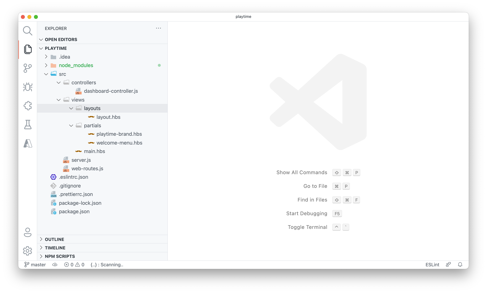
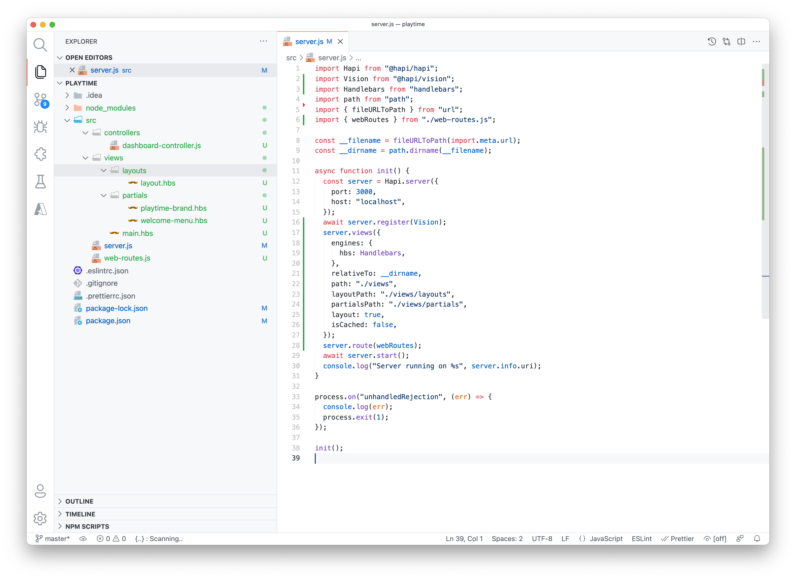
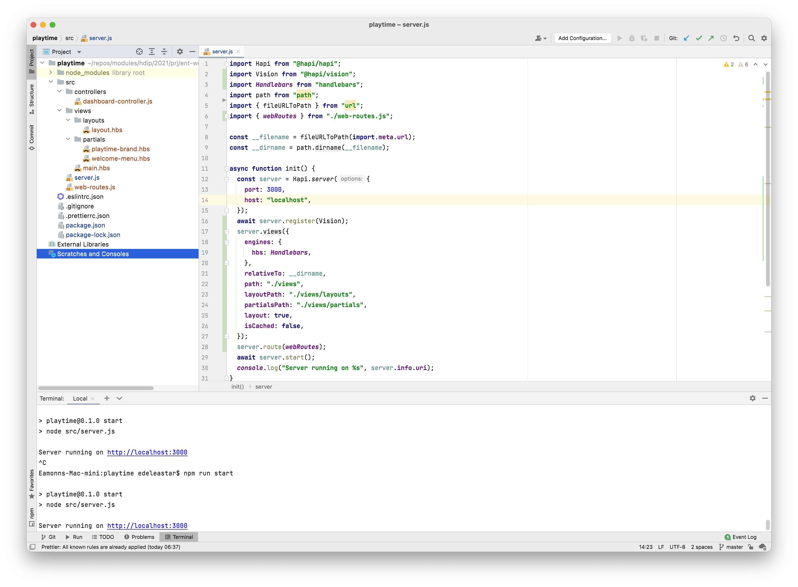
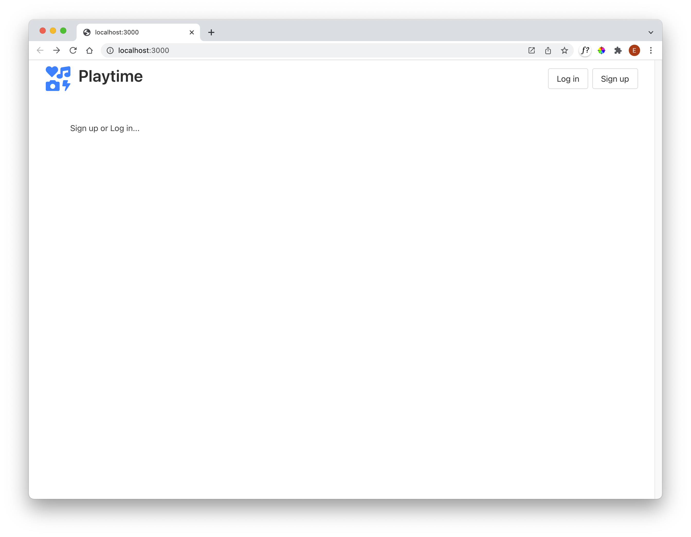

# View/Controllers

Install 2 additional components using a shell inside the project folder:

~~~bash
npm install @hapi/vision
npm install handlebars
~~~

Create the following files:

- layout.hbs
- main.hbs
- playtime-brand.hbs
- welcome-menu.hbs
- web-routes.js
- dashboard-controller.js

... using the folder structure as shown:

These are the contents of each of these files:

## layout.hbs

~~~html
<!DOCTYPE html>
<html lang="en-IE">
  <head>
    <meta charset="utf-8">
    <meta name="viewport" content="width=device-width, initial-scale=1">
    <title>{{title}}</title>
    <link rel="stylesheet" href="https://cdn.jsdelivr.net/npm/bulma@0.9.3/css/bulma.min.css">
    
  </head>
  <body>
    

      {{{content}}}
    

  </body>
</html>
~~~

## main.hbs

~~~html
{{> welcome-menu}}

<section class="section">
  
 Sign up or Log in... 

</section>
~~~

## playtime-brand.hbs

~~~handlebars

  <i style="font-size: 48px; color: Dodgerblue;" class="fas fa-icons"></i>
  
Playtime

~~~

## welcome-menu.hbs

~~~handlebars
<nav class="navbar" role="navigation" aria-label="main navigation">
  

    {{> playtime-brand}}
  

  

    

      

        

          <a class="button" id="login" href="/login"> Log in </a> <a class="button" id="signup" href="/signup"> Sign
          up </a>
        

      

    

  

</nav>

~~~

## dashboard-controller.js

~~~javascript
export const dashboardController = {
  index: {
    handler: async function (request, h) {
      return h.view("main");
    },
  },
};
~~~

## web-routes.js

~~~javascript
import { dashboardController } from "./controllers/dashboard-controller.js";

export const webRoutes = [{ method: "GET", path: "/", config: dashboardController.index }];
~~~

Server needs to be modified as follows:

## server.js

~~~javascript
import Hapi from "@hapi/hapi";
import Vision from "@hapi/vision";
import Handlebars from "handlebars";
import path from "path";
import { fileURLToPath } from "url";
import { webRoutes } from "./web-routes.js";

const __filename = fileURLToPath(import.meta.url);
const __dirname = path.dirname(__filename);

async function init() {
  const server = Hapi.server({
    port: 3000,
    host: "localhost",
  });
  await server.register(Vision);
  server.views({
    engines: {
      hbs: Handlebars,
    },
    relativeTo: __dirname,
    path: "./views",
    layoutPath: "./views/layouts",
    partialsPath: "./views/partials",
    layout: true,
    isCached: false,
  });
  server.route(webRoutes);
  await server.start();
  console.log("Server running on %s", server.info.uri);
}

process.on("unhandledRejection", (err) => {
  console.log(err);
  process.exit(1);
});

init();
~~~

In your IDE the project should look like this:

*VSCode*

*WebStorm*

Running the app:

~~~bash
npm run start
~~~

 It should be available here:

- <http://localhost:3000/>

  It should look like this:

