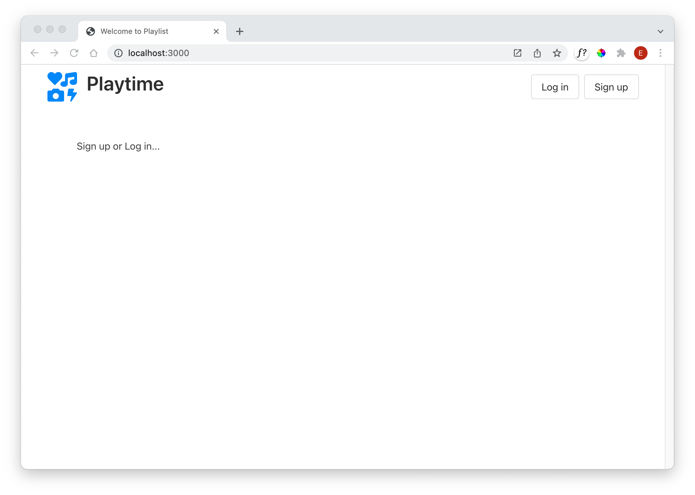
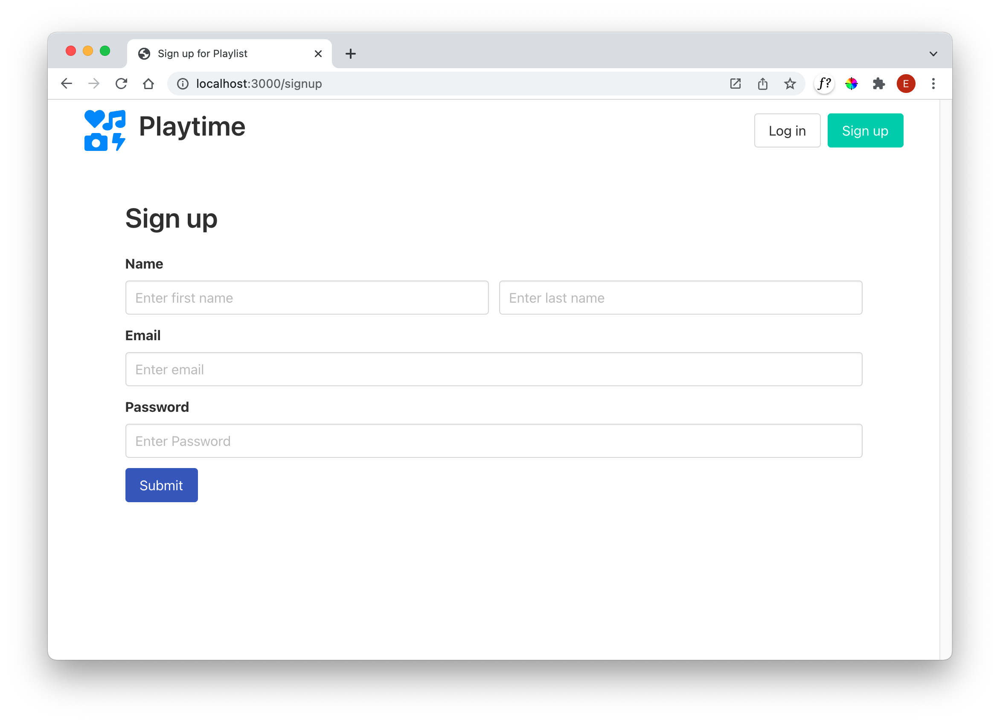
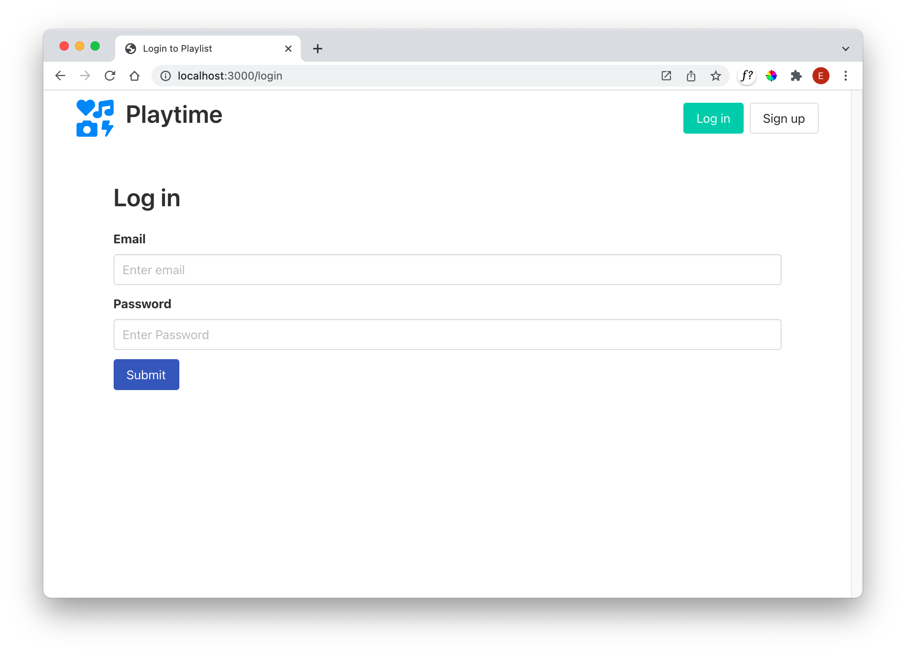
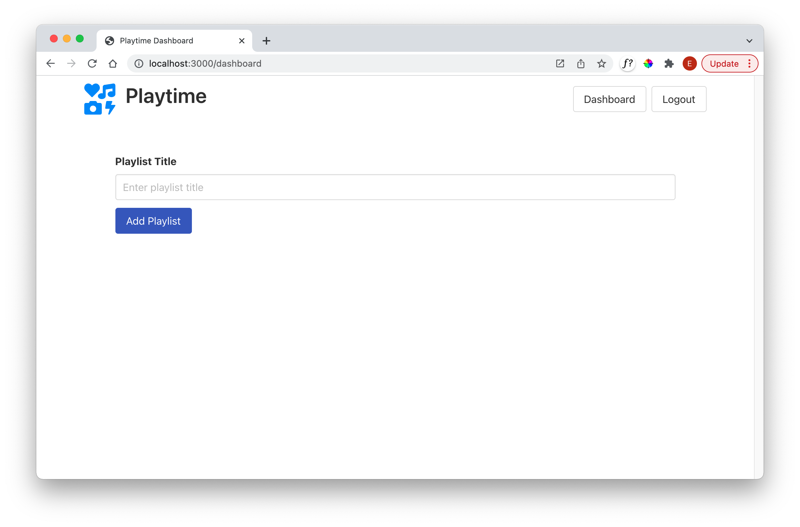
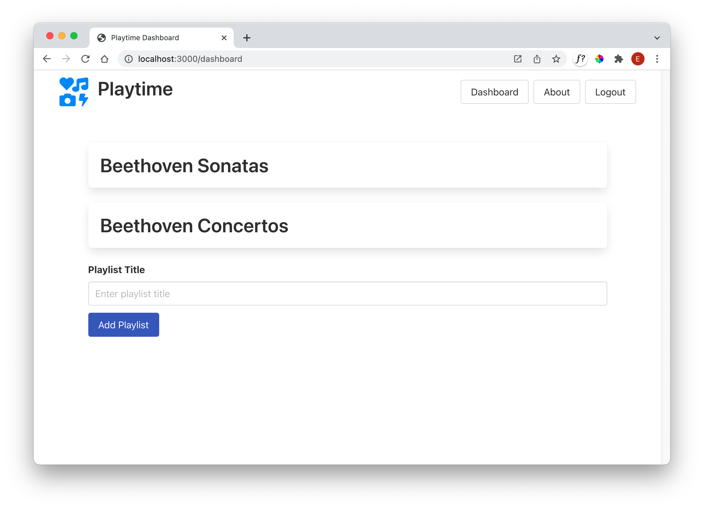

# Playtime UX

Below are the views we are about to scaffold:

These view use the Bulma Library:

- <https://bulma.io/>

This library is reasonably straightforward to use. We have included it in our `layout.hbs`. Have a quick look at this overview here:

- <https://bulma.io/documentation/overview/>

All of the views + partials are provided in the next step...

