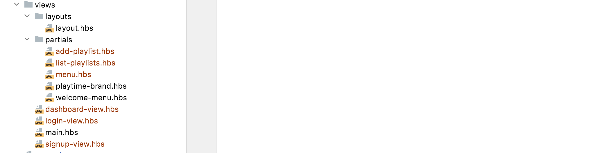

# Playtime Partials + Views

Include the partials below in this structure:

## add-playlist.hbs

~~~handlebars
<form action="/dashboard/addplaylist" method="POST">
  

    <label class="label">Playlist Title</label> <input class="input" type="text" placeholder="Enter playlist title" name="title">
  

  <button class="button is-link">Add Playlist</button>
</form>
~~~

## list-playlist.hbs

~~~handlebars
{{#each playlists}}
  

    <h2 class="title">
      {{title}}
    </h2>
  

{{/each}}
~~~

## menu.hbs

~~~handlebars
<nav class="navbar">
  

    {{> playtime-brand}}
  

  

    

      

        

          <a id="dashboard" class="button" href="/dashboard"> Dashboard </a> <a id="about" class="button" href="/about"> About </a> <a id="logout" class="button" href="/logout">
          Logout </a>
        

      

    

  

</nav>
~~~

## dashboard-view.hbs

~~~handlebars
{{> menu active="dashboard"}}

<section class="section">
  {{> list-playlists}}
  {{> add-playlist}}
</section>
~~~

## login-view.hbs

~~~handlebars
{{> welcome-menu active="login"}}

<section class="section">
  <h1 class="title">Log in</h1>
  <form action="/authenticate" method="POST">
    

      <label class="label">Email</label> <input class="input" type="text" placeholder="Enter email" name="email">
    

    

      <label class="label">Password</label> <input class="input" type="password" placeholder="Enter Password" name="password">
    

    

      <button class="button is-link">Submit</button>
    

  </form>
</section>
~~~

## signup-view.hbs

~~~handlebars
{{> welcome-menu active="signup"}}

<section class="section">
  <h1 class="title">Sign up</h1>
  <form action="/register" method="POST">
    <label class="label">Name</label>
    

      

        

          <input class="input" type="text" placeholder="Enter first name" name="firstName">
        

        

          <input class="input" type="text" placeholder="Enter last name" name="lastName">
        

      

    

    

      <label class="label">Email</label> <input class="input" type="text" placeholder="Enter email" name="email">
    

    

      <label class="label">Password</label> <input class="input" type="password" placeholder="Enter Password" name="password">
    

    

      <button class="button is-link">Submit</button>
    

  </form>
</section>
~~~

