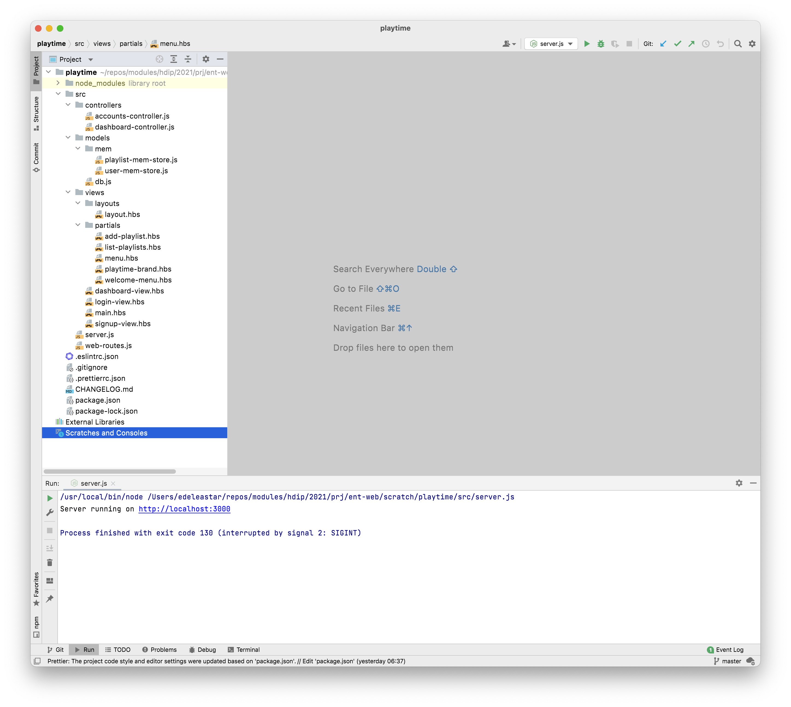
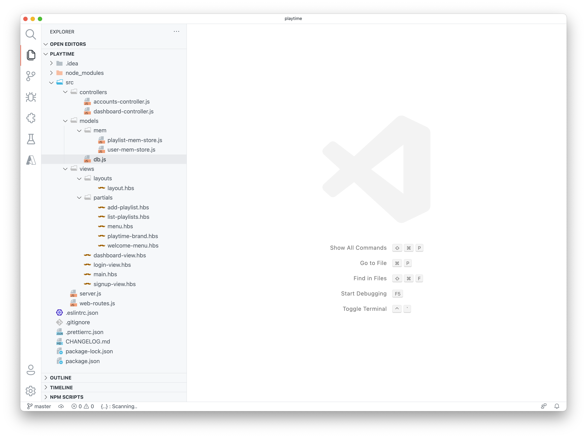

# Playtime Controllers + Routes

These are the controllers to drive the new views:

## controllers/accounts-controller.js

~~~javascript
import { db } from "../models/db.js";

export const accountsController = {
  index: {
    handler: function (request, h) {
      return h.view("main", { title: "Welcome to Playlist" });
    },
  },
  showSignup: {
    handler: function (request, h) {
      return h.view("signup-view", { title: "Sign up for Playlist" });
    },
  },
  signup: {
    handler: async function (request, h) {
      const user = request.payload;
      await db.userStore.addUser(user);
      return h.redirect("/");
    },
  },
  showLogin: {
    handler: function (request, h) {
      return h.view("login-view", { title: "Login to Playlist" });
    },
  },
  login: {
    handler: async function (request, h) {
      const { email, password } = request.payload;
      const user = await db.userStore.getUserByEmail(email);
      if (!user || user.password !== password) {
        return h.redirect("/");
      }
      return h.redirect("/dashboard");
    },
  },
  logout: {
    handler: function (request, h) {
      return h.redirect("/");
    },
  },
};

~~~

## controllers/dashboard-controller.js

~~~javascript
import { db } from "../models/db.js";

export const dashboardController = {
  index: {
    handler: async function (request, h) {
      const playlists = await db.playlistStore.getAllPlaylists();
      const viewData = {
        title: "Playtime Dashboard",
        playlists: playlists,
      };
      return h.view("dashboard-view", viewData);
    },
  },

  addPlaylist: {
    handler: async function (request, h) {
      const newPlayList = {
        title: request.payload.title,
      };
      await db.playlistStore.addPlaylist(newPlayList);
      return h.redirect("/dashboard");
    },
  },
};
~~~

These routes service these controllers:

## web-routes.js

~~~javascript
import { accountsController } from "./controllers/accounts-controller.js";
import { dashboardController } from "./controllers/dashboard-controller.js";

export const webRoutes = [
  { method: "GET", path: "/", config: accountsController.index },
  { method: "GET", path: "/signup", config: accountsController.showSignup },
  { method: "GET", path: "/login", config: accountsController.showLogin },
  { method: "GET", path: "/logout", config: accountsController.logout },
  { method: "POST", path: "/register", config: accountsController.signup },
  { method: "POST", path: "/authenticate", config: accountsController.login },

  { method: "GET", path: "/dashboard", config: dashboardController.index },
  { method: "POST", path: "/dashboard/addplaylist", config: dashboardController.addPlaylist },
];
~~~

Finally, we need to import and initialise the data store:

## server.js

~~~javascript
import Hapi from "@hapi/hapi";
import Vision from "@hapi/vision";
import Handlebars from "handlebars";
import path from "path";
import { fileURLToPath } from "url";
import { webRoutes } from "./web-routes.js";
import { db } from "./models/db.js";

const __filename = fileURLToPath(import.meta.url);
const __dirname = path.dirname(__filename);

async function init() {
  const server = Hapi.server({
    port: 3000,
    host: "localhost",
  });
  await server.register(Vision);
  server.views({
    engines: {
      hbs: Handlebars,
    },
    relativeTo: __dirname,
    path: "./views",
    layoutPath: "./views/layouts",
    partialsPath: "./views/partials",
    layout: true,
    isCached: false,
  });
  db.init();
  server.route(webRoutes);
  await server.start();
  console.log("Server running on %s", server.info.uri);
}

process.on("unhandledRejection", (err) => {
  console.log(err);
  process.exit(1);
});

init();
~~~

Start (or restart) the application now:

~~~bash
npm start
~~~

You should be able to:

- Sign up
- Log in
- Add playlists
- Logout

The project should be structure as follows:

*WebStorm*

*VSCode*

