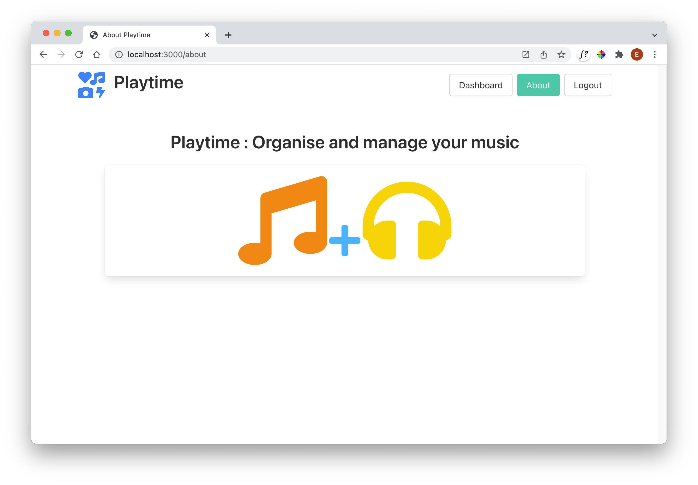

# Exercises

This is the Playtime application at the end if this lab:

- [playtime-0.1.0.zip](./archives/playtime-0.1.0.zip)

The following 2 exercises can now be attempted - you can use your own version of the project as constructed during this lab, or use the above project archive as the basis if you like.

If you use the above project, be sure to open a shell and run:

~~~bash
npm install
~~~

... before working on the project.

In the next lab, the solutions to these exercises will be provided.

## Exercise 1

Introduce an About view - perhaps displaying something like this:

This should be displayed when the about button is pressed. The images above are engaged from the Font Awesome library, already included in the project:

- <https://fontawesome.com/v5.15/icons>

## Exercise 2

Build out the ability to add tracks to a view - perhaps a UX like this:

The 'folder' icon above should display:

`Add Track` will add a new track.

These is the UX implementation of the above views:

## list-playlists.hbs

~~~handlebars
{{#each playlists}}
  

    <h2 class="title">
      {{title}}
    </h2>
    <a href="/playlist/{{_id}}" class="button">
      
        <i class="fas fa-folder-open"></i>
      
    </a>
  

{{/each}}
~~~

## list-tracks.hbs

~~~handlebars
<table class="table is-fullwidth">
  <thead>
    <tr>
      <th>Track</th>
      <th>Artist</th>
      <th>Duration</th>
    </tr>
  </thead>
  <tbody>
    {{#each playlist.tracks}}
      <tr>
        <td>
          {{title}}
        </td>
        <td>
          {{artist}}
        </td>
        <td>
          {{duration}}
        </td>
      </tr>
    {{/each}}
  </tbody>
</table>

~~~

## add-tracks.hbs

~~~handlebars
<form class="box" action="/playlist/{{playlist._id}}/addtrack" method="POST">
  <label>Enter Track Details:</label>
  

    

      

        <input class="input" type="text" placeholder="Enter Title" name="title">
      

      

        <input class="input" type="text" placeholder="Enter Artist" name="artist">
      

      

        <input class="input" type="text" placeholder="Enter duration" name="duration">
      

    

  

  <button class="button is-primary">Add Track</button>
</form>
~~~

## playlist-view.hbs

~~~handlebars
{{> menu}}

<section class="section">
  

    {{playlist.title}}
  

  {{> list-tracks}}
  {{> add-track}}
</section>
~~~

To compete these features you will need to implement these new components:

- playlist-controller.js
- track-mem-store.js

In addition, you will need to make changes to:

- playlist-mem-store.js
- web-routes.js
- db.js

This is a challenging first exercise - and will be fully worked through in the next lab.

