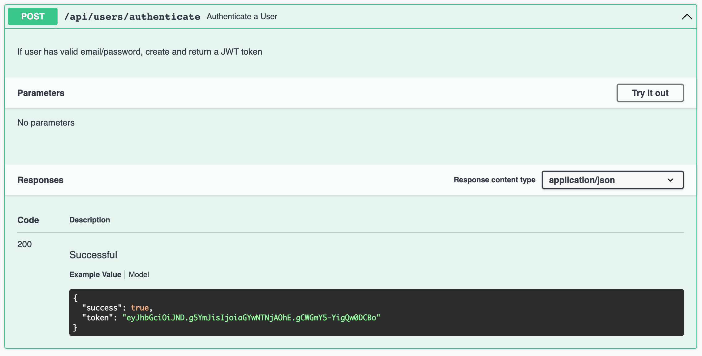

# Authenticate Swagger Response

This is the endpoint we would like to annotate:

#### users-api.js

~~~javascript
  authenticate: {
    auth: false,
    handler: async function (request, h) {
      try {
        const user = await db.userStore.getUserByEmail(request.payload.email);
        if (!user) {
          return Boom.unauthorized("User not found");
        }
        if (user.password !== request.payload.password) {
          return Boom.unauthorized("Invalid password");
        }
        const token = createToken(user);
        return h.response({ success: true, token: token }).code(201);
      } catch (err) {
        return Boom.serverUnavailable("Database Error");
      }
    },
  },
~~~

Start by simple documentation:

~~~javascript
 authenticate: {
    auth: false,
    handler: async function(request, h) {
      //...
    },
    tags: ["api"],
    description: "Authenticate  a User",
    notes: "If user has valid email/password, create and return a JWT token",
  }
~~~

This should populate our documentation site, without any parameter/response details.

We can start with the response, define this new schema:

### joi-schema.js

~~~javascript
export const JwtAuth = Joi.object()
  .keys({
    success: Joi.boolean().example("true").required(),
    token: Joi.string().example("eyJhbGciOiJND.g5YmJisIjoiaGYwNTNjAOhE.gCWGmY5-YigQw0DCBo").required(),
  })
  .label("JwtAuth");
~~~

... and we can include it in the end point:

### users-api.js

~~~javascript
import { UserSpec, UserSpecPlus, IdSpec, UserArray, JwtAuth } from "../models/joi-schemas.js";
...
  authenticate: {
    //...
    notes: "If user has valid email/password, create and return a JWT token",
    response: { schema: JwtAuth, failAction: validationError }
  }
~~~

The tests should continue to pass, and our documentation should be enhanced:

