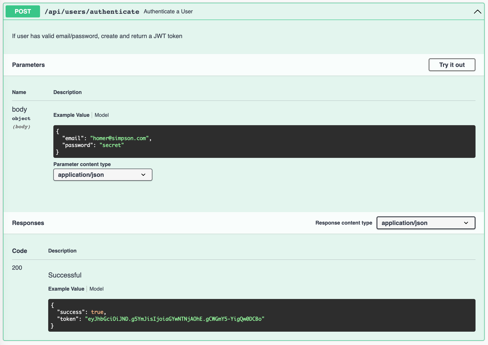

# Authenticate Swagger Parameters

We already have a **UserCredentialsSpec** schema:

### joi-schema.js

~~~javascript
export const UserCredentialsSpec = Joi.object()
  .keys({
    email: Joi.string().email().example("homer@simpson.com").required(),
    password: Joi.string().example("secret").required(),
  })
  .label("UserCredentials");
~~~

We could use this to document the parameters for the authenticate end point:

### user-api.js

~~~javascript
import { UserCredentialsSpec, UserSpec, UserSpecPlus, IdSpec, UserArray, JwtAuth } from "../models/joi-schemas.js";

  authenticate: {
    //...
    notes: "If user has valid email/password, create and return a JWT token",
    validate: { payload: UserCredentialsSpec, failAction: validationError },
    response: { schema: JwtAuth, failAction: validationError }
  }
~~~

This will produce correct parameter documentation:

However, tests will start to fail now - looking at the logs we will see why:

~~~bash
... 
"firstName" is not allowed
...
~~~

This origin of this is our authenticate functions:

~~~javascript
    await playtimeService.authenticate(maggie);
~~~

Maggie is a complete user object:

### fixtures.js

~~~javascript
export const maggie = {
  firstName: "Maggie",
  lastName: "Simpson",
  email: "maggie@simpson.com",
  password: "secret"
};
~~~

... and the validation checks are not expecting firstName and lastName.

Introduce a new fixture:

~~~javascript
export const maggieCredentials = {
  email: "maggie@simpson.com",
  password: "secret"
};
~~~

... and replace all authenticate calls across all tests with:

~~~javascript
... await playtimeService.authenticate(maggieCredentials);
~~~

The tests should be back in action now.
