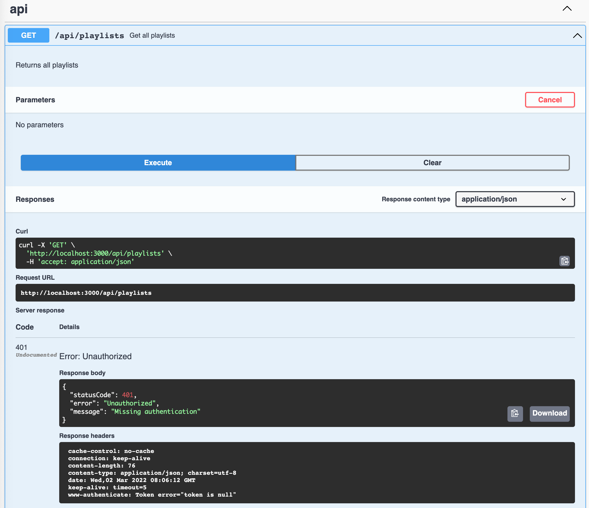
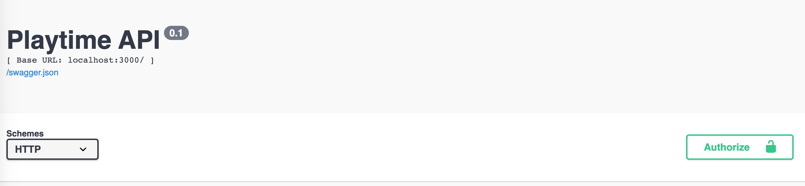
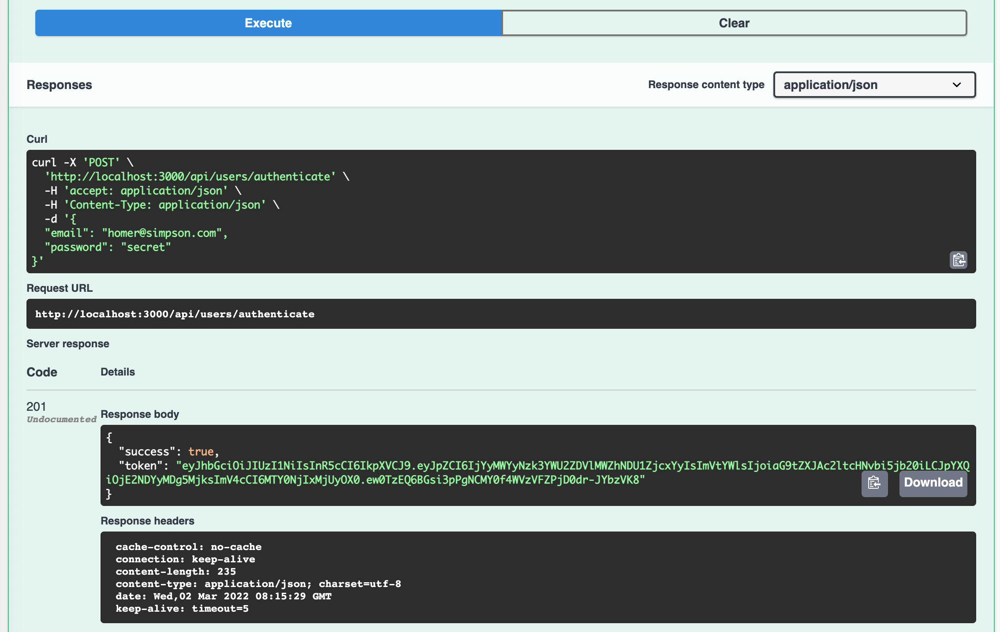
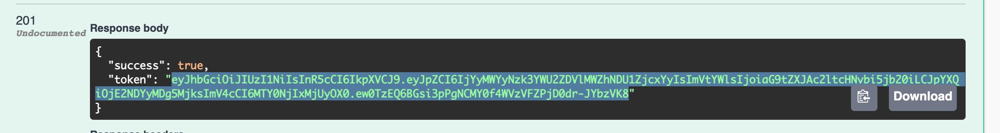
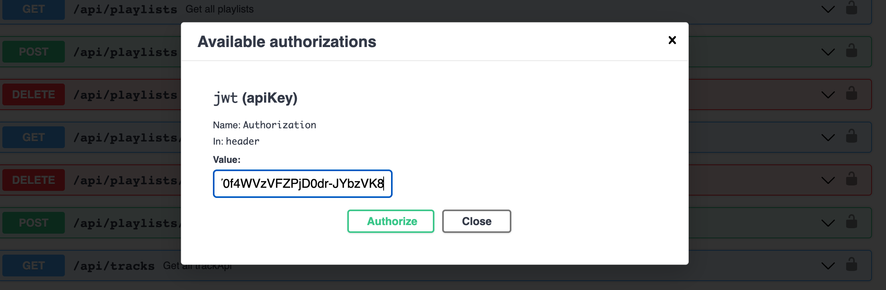
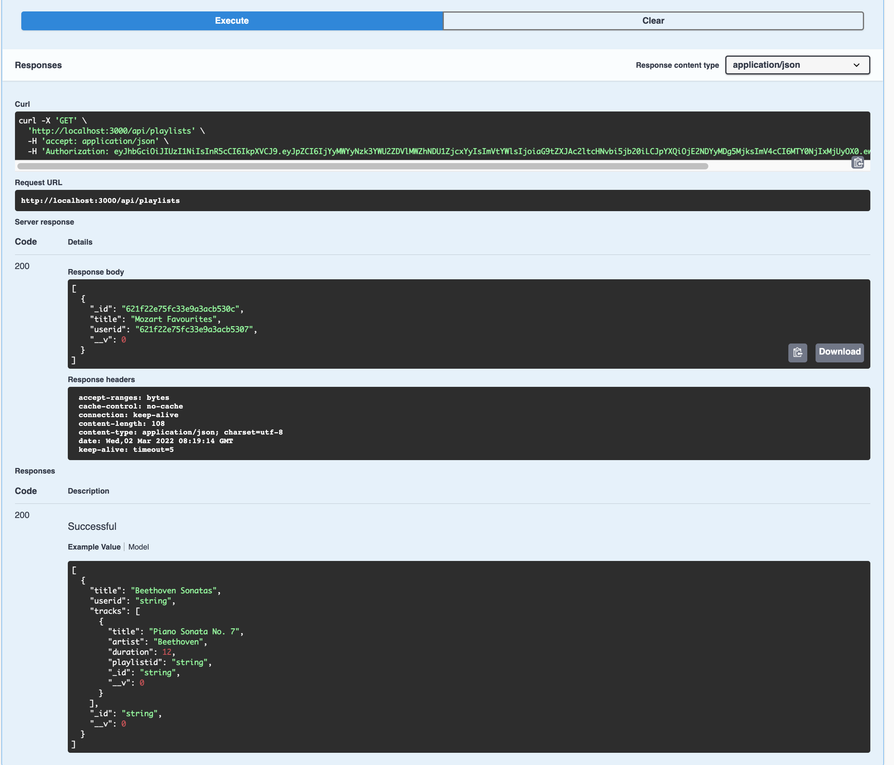

# Swagger Authentication

The Swagger features to invoke our api no longer works as almost all routes are secured:

Unless we can figure out a way of sending a valid JWT token, we will get "401" Unauthorised on all routes.

The swagger plugin we are using does, however, have an interface for providing a security strategy to the documentation engine. This is achieved by additional parameters in SwaggerOptions:

### server.js

~~~javascript
const swaggerOptions = {
  info: {
    title: "Playtime API",
    version: "0.1"
  },
  securityDefinitions: {
    jwt: {
      type: "apiKey",
      name: "Authorization",
      in: "header"
    }
  },
  security: [{ jwt: [] }]
};
~~~

Once the **securityDefintions** above are provided, a new button appears on the documentation site:

This button allows us to enter a token to be used for all requests:

To see this in action, use the interface to create a user and authenticate (these are open routes). The default/example data will suffice - and the authenticate route will return a token:

We can copy this token:

... and paste into the Authorisation dialog:

Until we log out, our routes will now be authenticated and should work as expected:

You can see the **Authorization** header in the Curl request above.
