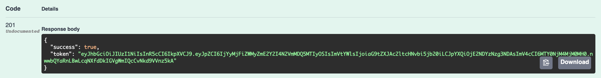
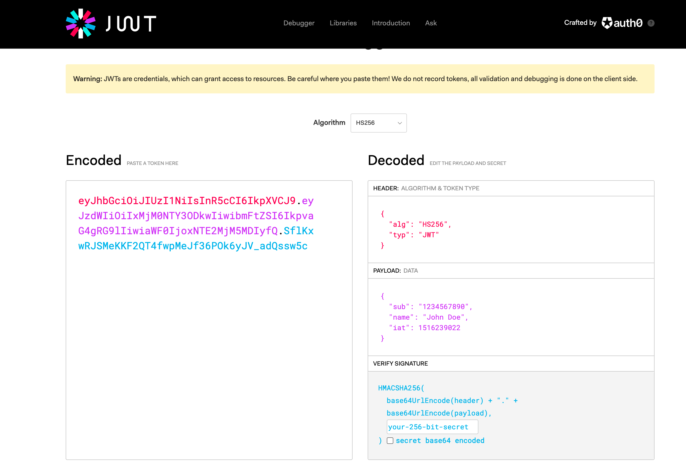

# JWT.io

To verify the veracity of the token, gaining more confidence in our implementation, try this service here:

- <https://jwt.io/>

Using the swagger documentation, create and authenticate a user, and copy the token to the clipboard:

Pasting this into the jwt.io service, we can decode and inspect the key:

