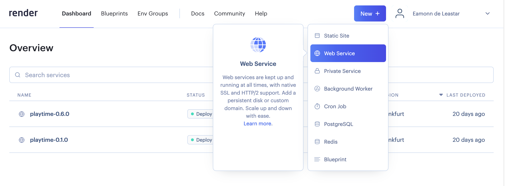
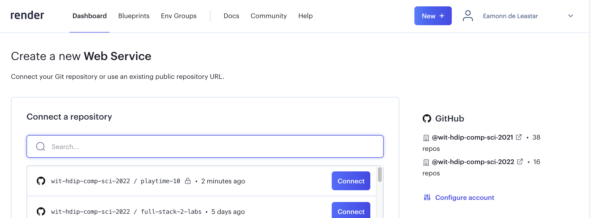
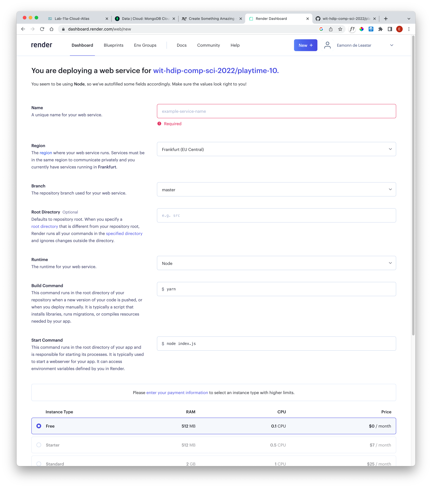
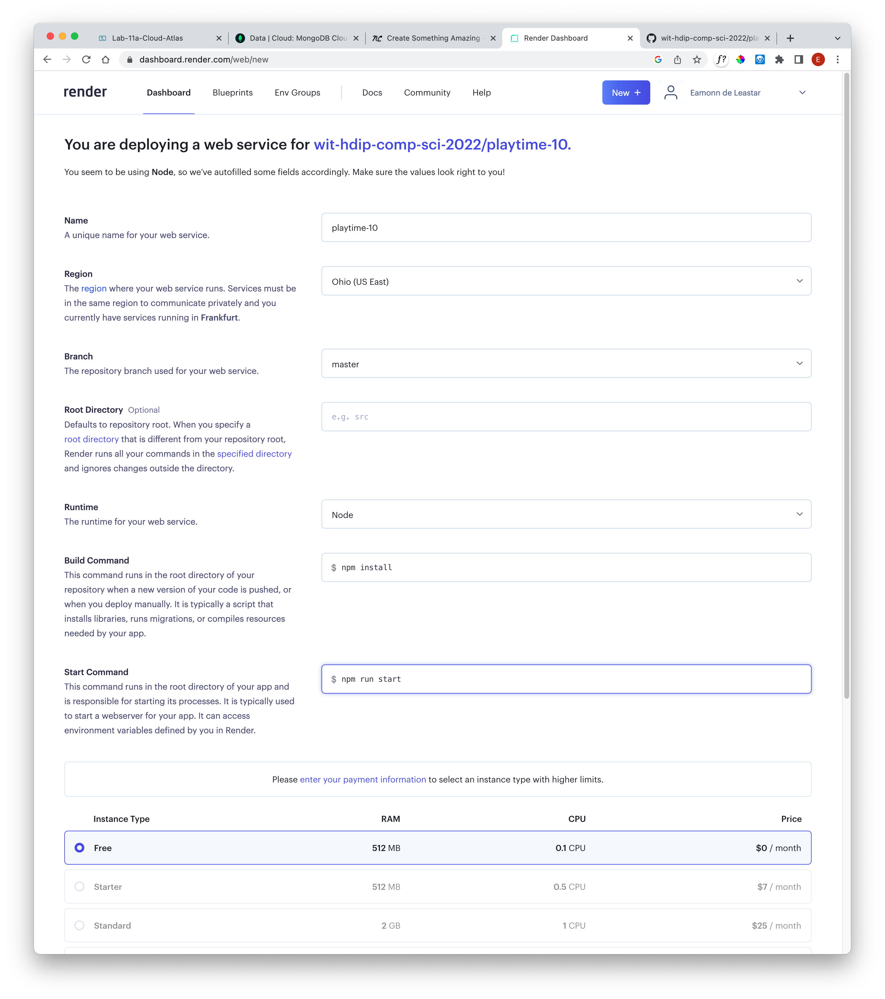

# Create the Application

In the render dashboard:

- <https://dashboard.render.com/>

... and create a new "Web Service"

If you set up your account on Render connected to your Github account, then you should be able to connect to the project you wish to deploy now:

This will make available a configuration screen:

Set the following parameters:

Press the Create Web Service button (scroll down to reveal this).
