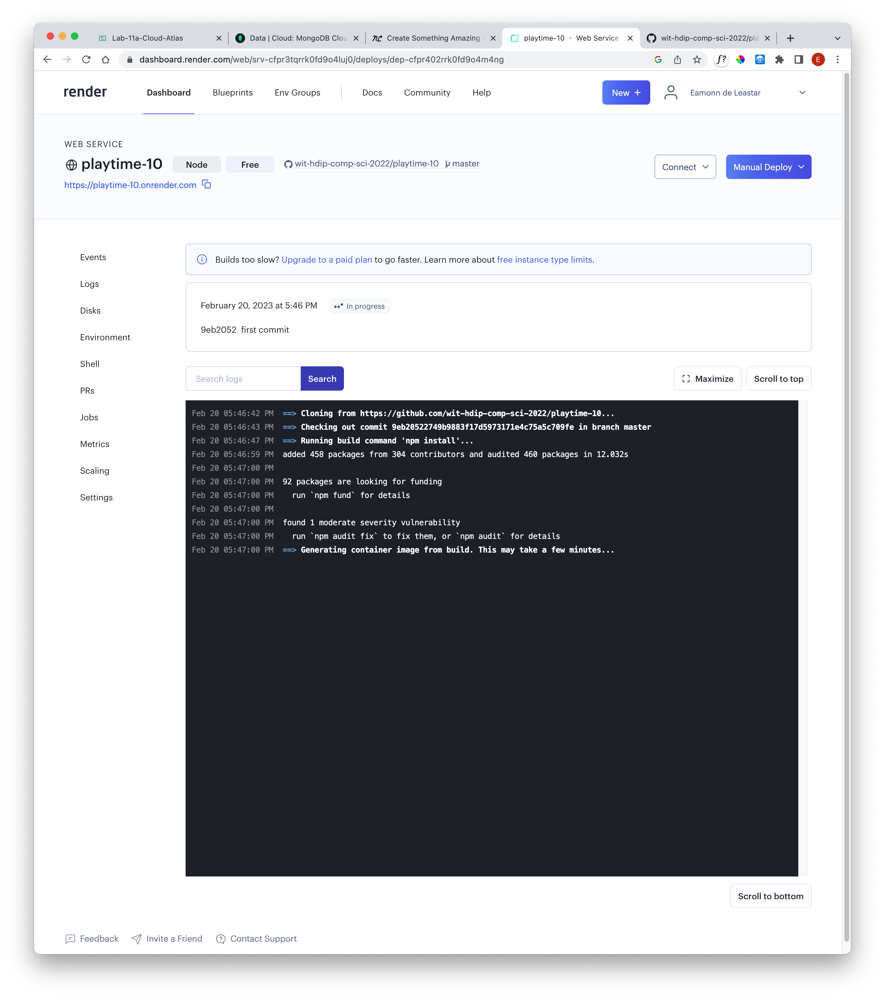
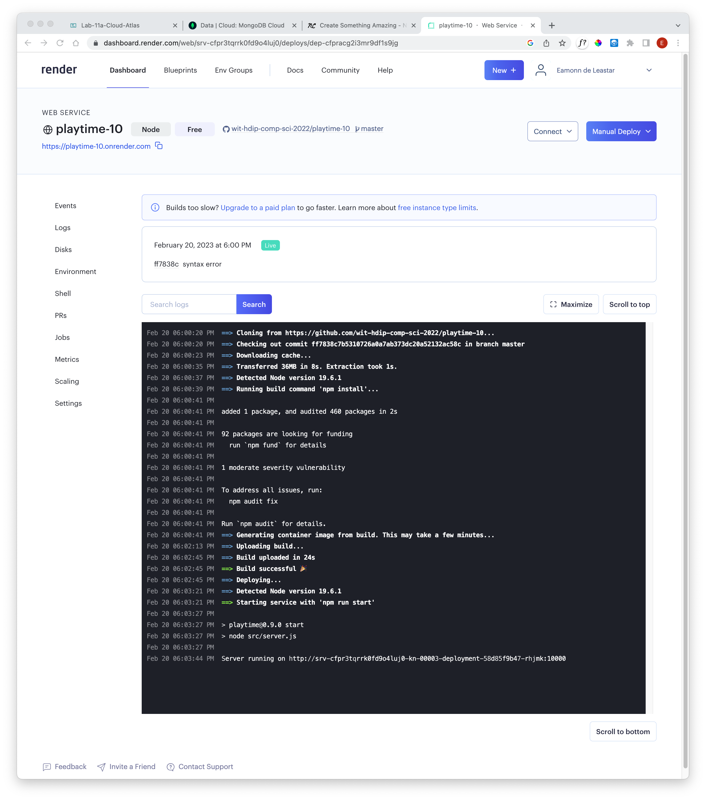
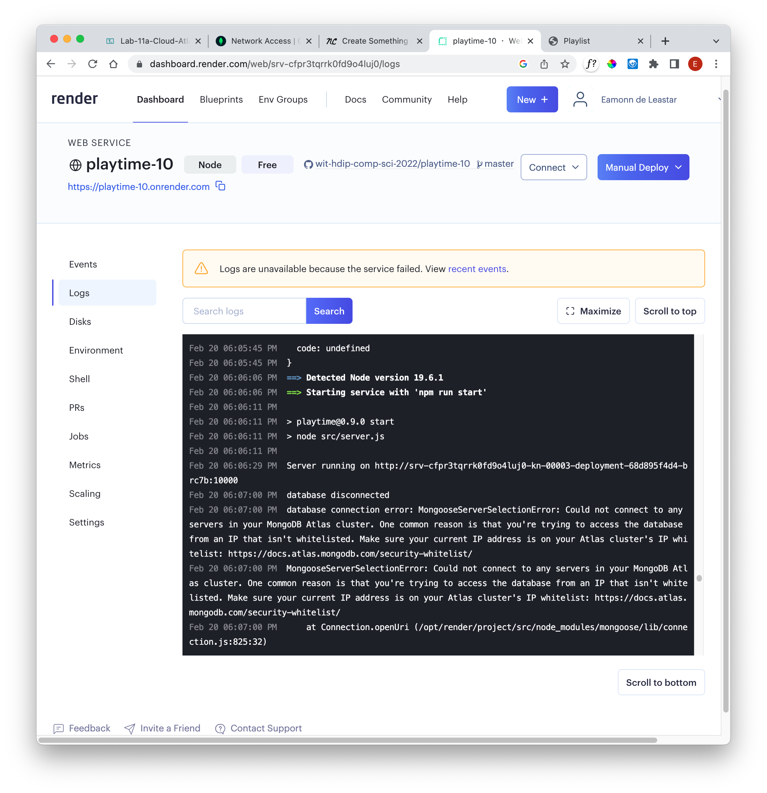

# Deployment

The free plan will take a little while to launch, but we expect it to eventually run successfully:

If the application is extremely slow launching, or you have difficulty logging in - check the logs:

In the above example, an exception is thrown as the database on Mongo Cloud Access is misconfigured - access is not available from any IP address. If this occurs, you will have to enable Network Access to any IP address on that service.

