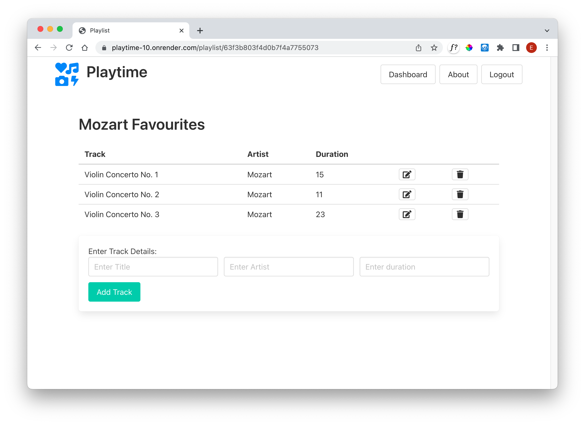
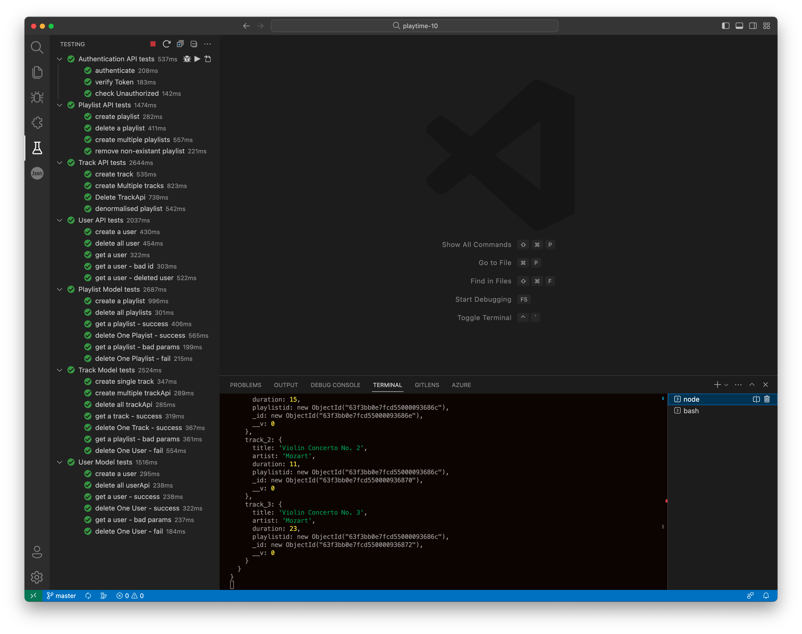
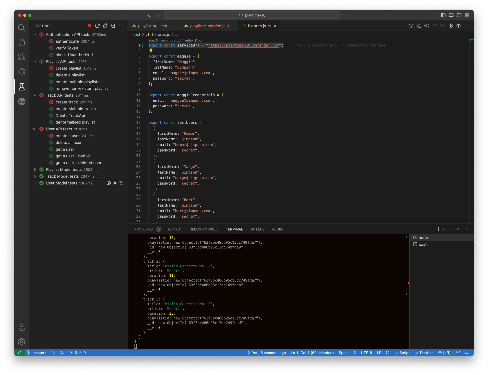
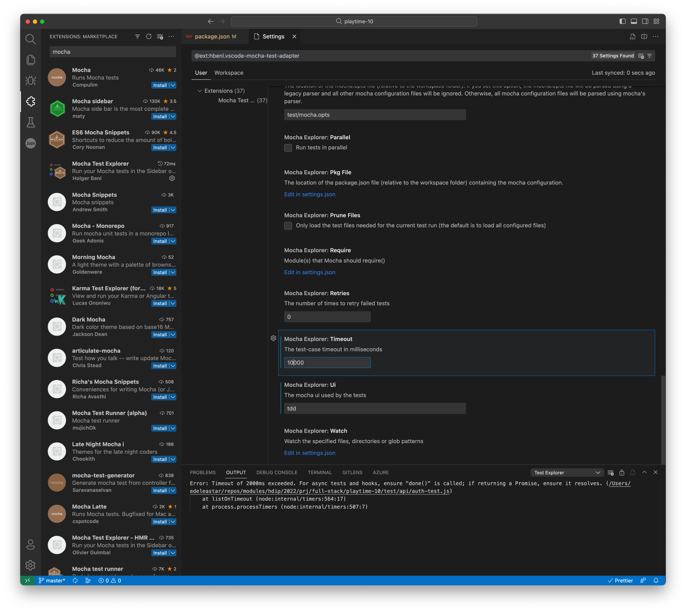
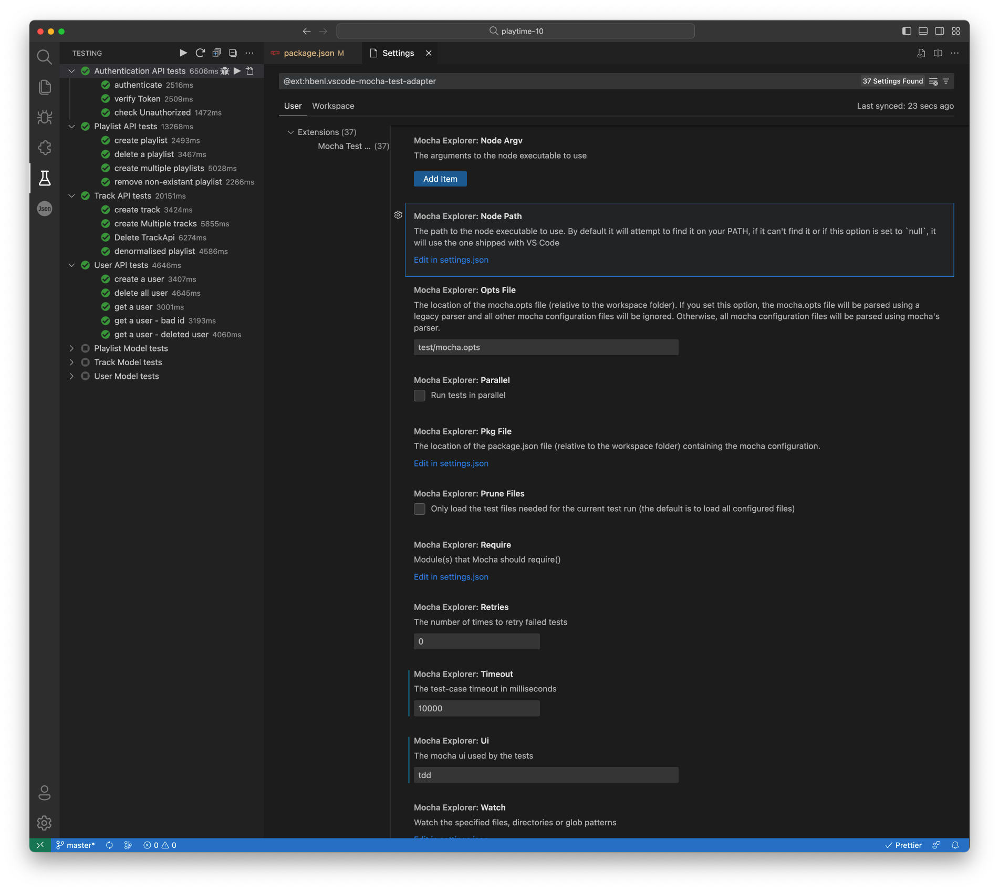

## Test

If you have some seeded data then you should be able to log in and browse this now on the url provided for the project.

We also have a suite of unit tests to exercise the API. Run this locally - on our own workstations - using the test infrastructure that is part of the project:

However, these tests operate against the local version of the project. This is defined in the fixtures file:

### fixtures.js

~~~javascript
export const serviceUrl = "http://localhost:3000";
~~~

Change this to the URL of our deployed application:

~~~javascript
export const serviceUrl = "https://playtime-10-XXX.onrender.com";
~~~

Although the mongo store tests may continue to run, the API tests may fail:

This will be because we need some additional latency in the tests - especially if we are using the free render plan. In VScode, this setting is available Mocha Test Explorer, the plugin we are using:

This is available opening settings - and scroll down the the Timeout parameter. 10000 should work. Try the tests again, hopefully they should pass this time:

