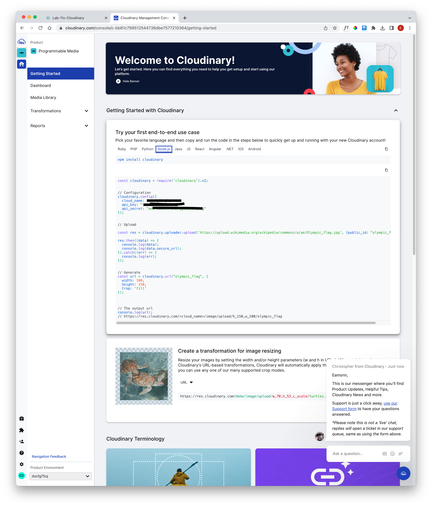

# Cloudinary Account

It is possible to store small images in a Mongo Database, but it is not generally recommended for performance and other reasons. Instead, there are a range of services for maintaining stores of images. Cloudinary is a leader in this area.

Set up an account on the Cloudinary service:

- <https://cloudinary.com/>

Once signed up, you should able to access your Cloudinary account

Under node.js settings as shown above, locate and copy the api keys to your .env file:

### .env

~~~bash
# ...
cloudinary_name=edelXXX
cloudinary_key=9543XXX75281
cloudinary_secret=ecslXXXXXWZMKF8
~~~

We will use these values in our application to store images in the service.