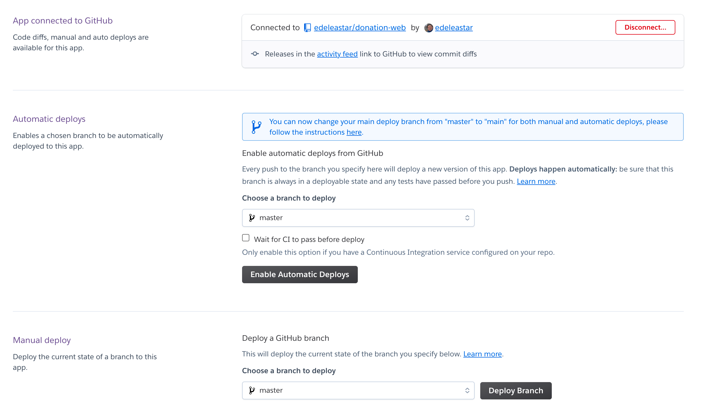

# Exercises

## Exercise 1: Deployment Method

On Heroku, inspect the `Deploy` panel:

Notice our method is currently `Heroku Git`.

Experiment with the next one over `GitHub`. This will allow you to connect directly to your github repo. Experiment with the various options, for instance try `Enable Automatic Deploys`:

One pattern you might adopt is to automatically deploy `master`, but do your development on `development` and `feature` branches. When you are happy with a feature you merge it onto `development`. If this works ok, then merge into `master`. This last merge will trigger an automatic deploy.

You can use the Github web interface to do the merge operations.

## Exercise 2: Glitch

When working with `fremium` services, is it useful to have more than one option. This can be important if the terms of service change (and the free tiers are removed).

You may recall the glitch service from ICT Skills 1:

- <https://glitch.com/>

Deploy the application to the Glitch service as an experiment and a backup.
