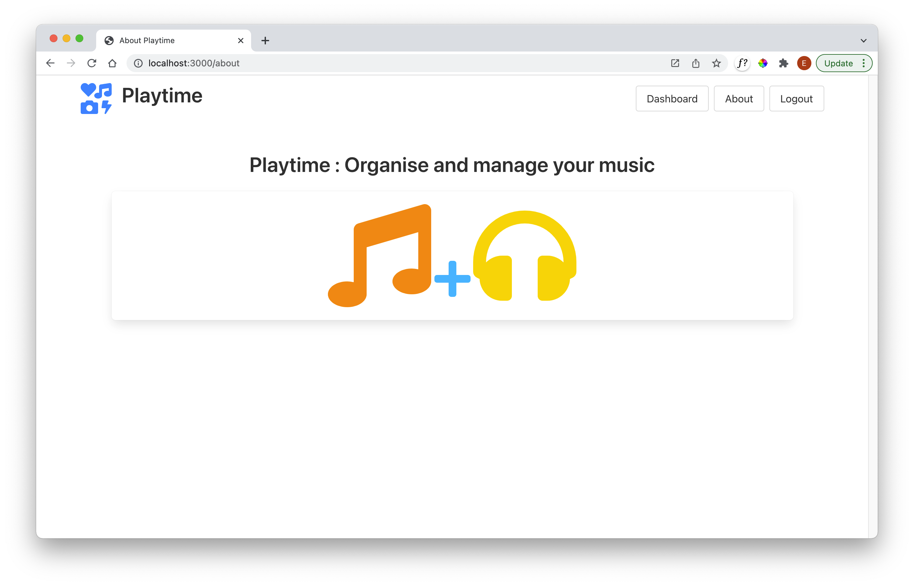

# About View 

### Exercise 01

Introduce an About view:

### Exercise 01 Solution

### about-controller.js

~~~javascript
export const aboutController = {
  index: {
    handler: function (request, h) {
      const viewData = {
        title: "About Playtime",
      };
      return h.view("about-view", viewData);
    },
  },
};
~~~

### about-view.hbs

~~~handlebars
{{> menu active="about"}}

<section class="hero">
  

    

      Playtime : Organise and manage your music 

    

      <i class="fas fa-music fa-10x" style="color:darkorange"></i>
      <i class="fas fa-plus fa-4x" style="color:deepskyblue"></i>
      <i class="fas fa-headphones fa-10x" style="color:gold"></i>
    

  

</section>
~~~

### menu.hbs

~~~handlebars
<nav class="navbar">
  

    {{> playtime-brand}}
  

  

    

      

        

          <a id="dashboard" class="button" href="/dashboard"> Dashboard </a>
          <a id="about" class="button" href="/about"> About </a>
          <a id="logout" class="button" href="/logout"> Logout </a>
        

      

    

  

</nav>
~~~

### web-routes.js

...
import { aboutController } from "./controllers/about-controller.js";
...

~~~javascript
  { method: "GET", path: "/about", config: aboutController.index },
~~~

Verify that the about view is available now for logged in users.