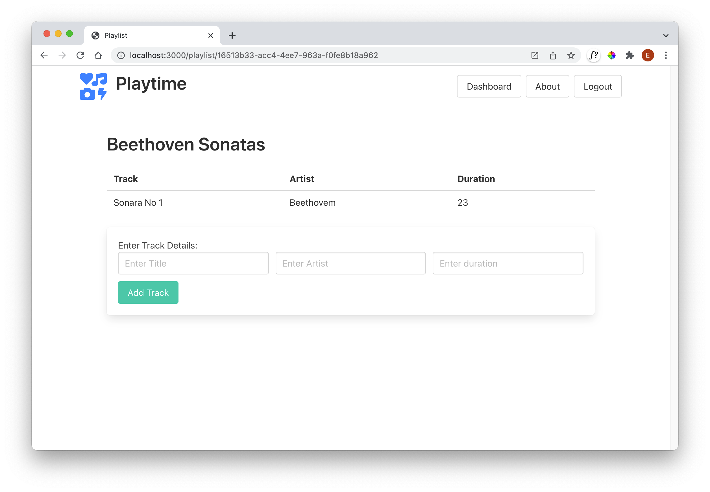

# Playlist/Track UX

### Exercise 02:

Implement the ability to add tracks to a playlist:

## Exercise 02 Solution - UX

Extend the list-playlists partial as follows:

## list-playlists.hbs

~~~handlebars
{{#each playlists}}
  

    <h2 class="title">
      {{title}}
    </h2>
    <a href="/playlist/{{_id}}" class="button">
      
        <i class="fas fa-folder-open"></i>
      
    </a>
  

{{/each}}
~~~

Introduce these new partials:

- list-tracks.hbs
- add-tracks.hbs

## list-tracks.hbs

~~~handlebars
<table class="table is-fullwidth">
  <thead>
    <tr>
      <th>Track</th>
      <th>Artist</th>
      <th>Duration</th>
    </tr>
  </thead>
  <tbody>
    {{#each playlist.tracks}}
      <tr>
        <td>
          {{title}}
        </td>
        <td>
          {{artist}}
        </td>
        <td>
          {{duration}}
        </td>
      </tr>
    {{/each}}
  </tbody>
</table>
~~~

## add-track.hbs

~~~handlebars
<form class="box" action="/playlist/{{playlist._id}}/addtrack" method="POST">
  <label>Enter Track Details:</label>
  

    

      

        <input class="input" type="text" placeholder="Enter Title" name="title">
      

      

        <input class="input" type="text" placeholder="Enter Artist" name="artist">
      

      

        <input class="input" type="text" placeholder="Enter duration" name="duration">
      

    

  

  <button class="button is-primary">Add Track</button>
</form>
~~~

This is a new view:

## playlist-view.hbs

~~~handlebars
{{> menu}}

<section class="section">
  

    {{playlist.title}}
  

  {{> list-tracks}}
  {{> add-track}}
</section>
~~~