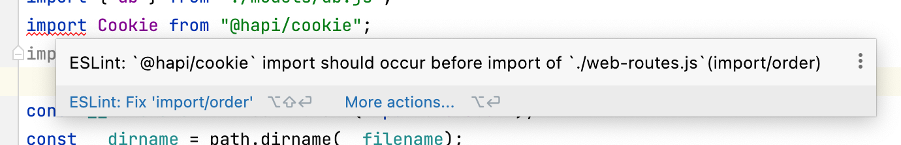
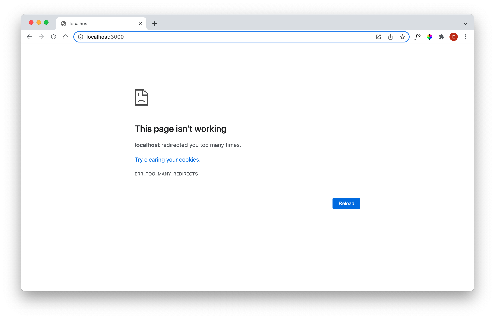

# Sessions

Currently our playlists are effectively global - no matter which user logs in, the same playlists is displayed. In order to correct this (making the playlists tied to each account), we need **Sessions**.

Install the following component:

~~~bash
npm install @hapi/cookie
~~~

We need to register this plugin in server.js:

## server.js

First introduce these imports:

~~~handlebars
...
import Cookie from "@hapi/cookie";
import { accountsController } from "./controllers/accounts-controller.js";
...
~~~

When you introduce the imports - you may see this ESLint error:

This is an example of a style violation - but not a syntax error as such. Use the autocorrect to fix the import order, and remove the error.

Now register the plugin:

~~~javascript
  await server.register(Cookie);
~~~

Place this just after the registration of the vision plugin.

We also need to configure authentication after the plugin is registered:

~~~javascript
...
  server.auth.strategy("session", "cookie", {
    cookie: {
      name: "playtime",
      password: "secretpasswordnotrevealedtoanyone",
      isSecure: false,
    },
    redirectTo: "/",
    validateFunc: accountsController.validate,
  });
  server.auth.default("session");
...
~~~

This configures an authentication strategy for our app - and sets the strategy as the default for all routes. It also defines a `validateFunc` - a type of `hook` method. This is triggered as the default for every route to carry out some authentication related check. Introduce this method into the Accounts Controller:

## accounts-controller.js

~~~javascript
  async validate(request, session) {
    const user = await db.userStore.getUserById(session.id);
    if (!user) {
      return { valid: false };
    }
    return { valid: true, credentials: user };
  },
~~~

The function has access to a `session` object - which will have the users ID. We use this ID to locate the user object from the store and, if found, return this object:

~~~javascript
 { valid: true, credentials: user };
~~~

Otherwise, if user not found, return:

~~~javascript
{ valid: false };
~~~

We can rework the `accountsController` login hander as follows:

~~~javascript
    handler: async function (request, h) {
      const { email, password } = request.payload;
      const user = await db.userStore.getUserByEmail(email);
      if (!user || user.password !== password) {
        return h.redirect("/");
      }
      request.cookieAuth.set({ id: user._id });
      return h.redirect("/dashboard");
    },
~~~

In the above, if we are logging in a valid user, we set the cookie:

~~~javascript
      request.cookieAuth.set({ id: user._id });
~~~

### Default Strategy

Running the app now will see it fail with a strange error:

This failure is because we have set "session" as the default strategy:

~~~javascript
  server.auth.default("session");
~~~

If you comment out this line, the app will work again (sort of), but our sessions will be disabled - ie. we will be unable to identify the logged in user. We will fix this in the next step.

