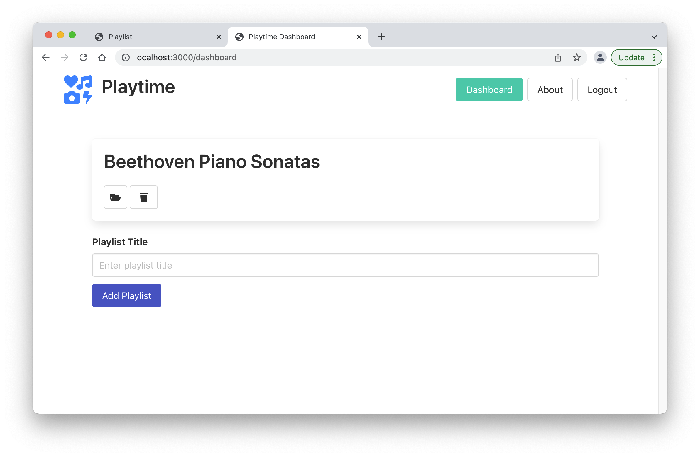
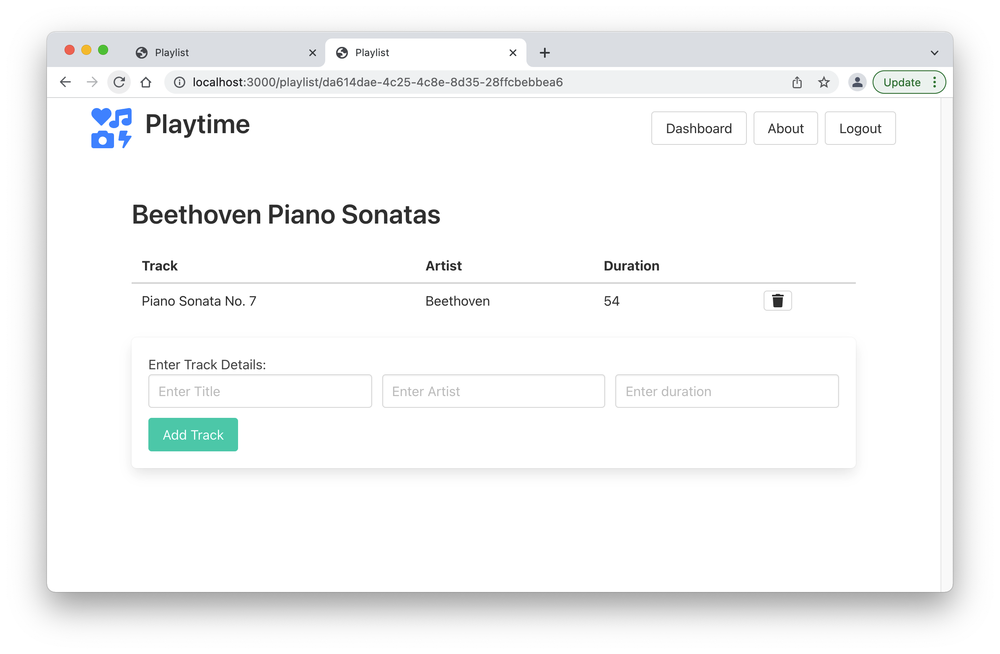

# Exercise 01 & 02

Introduce a delete playlist feature & track feature:

## Exercise 01 & 02 Solution

Include a delete button in the list-playlists and list-tracks partials:

### list-playlists.hbs

~~~handlebars
{{#each playlists}}
  

    <h2 class="title">
      {{title}}
    </h2>
    <a href="/playlist/{{_id}}" class="button">
      
        <i class="fas fa-folder-open"></i>
      
    </a>
    <a href="/dashboard/deleteplaylist/{{_id}}" class="button">
      <i class="fas fa-trash"></i>
    </a>
  

{{/each}}
~~~

### list-tracks.hbs

~~~handlebars
<table class="table is-fullwidth">
  <thead>
    <tr>
      <th>Track</th>
      <th>Artist</th>
      <th>Duration</th>
      <th></th>
    </tr>
  </thead>
  <tbody>
    {{#each playlist.tracks}}
      <tr>
        <td>
          {{title}}
        </td>
        <td>
          {{artist}}
        </td>
        <td>
          {{duration}}
        </td>
        <td>
          <a href="/playlist/{{../playlist._id}}/deletetrack/{{_id}}" class="ui icon button">
            <i class="fas fa-trash"></i>
          </a>
        </td>
      </tr>
    {{/each}}
  </tbody>
</table>
~~~

These buttons will drive the additional routes:

### web-routes.js

~~~javascript
  { method: "GET", path: "/dashboard/deleteplaylist/{id}", config: dashboardController.deletePlaylist },
  { method: "GET", path: "/playlist/{id}/deletetrack/{trackid}", config: playlistController.deleteTrack },
~~~

We then need new `actions` to service the above routes:

### dashboard-controller.js

~~~javascript
  deletePlaylist: {
    handler: async function (request, h) {
      const playlist = await db.playlistStore.getPlaylistById(request.params.id);
      await db.playlistStore.deletePlaylistById(playlist._id);
      return h.redirect("/dashboard");
    },
  },
~~~

### playlist-controller.js

~~~javascript
  deleteTrack: {
    handler: async function(request, h) {
      const playlist = await db.playlistStore.getPlaylistById(request.params.id);
      await db.trackStore.deleteTrack(request.params.trackid);
      return h.redirect(`/playlist/${playlist._id}`);
    },
  },
~~~

Check that delete playlist and track work as expected now.
