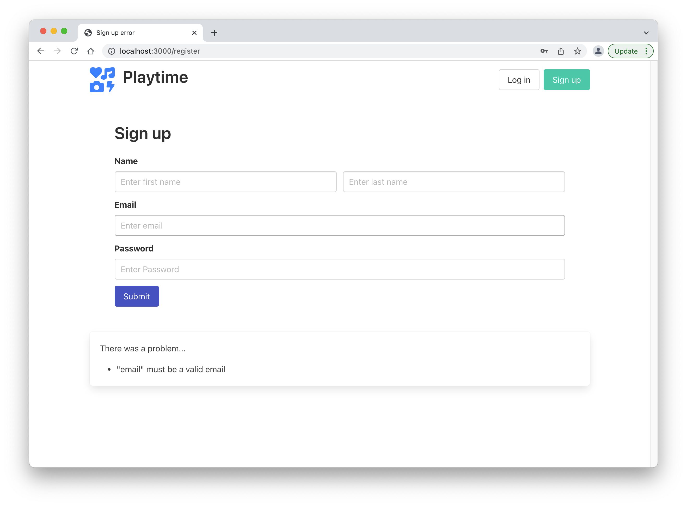
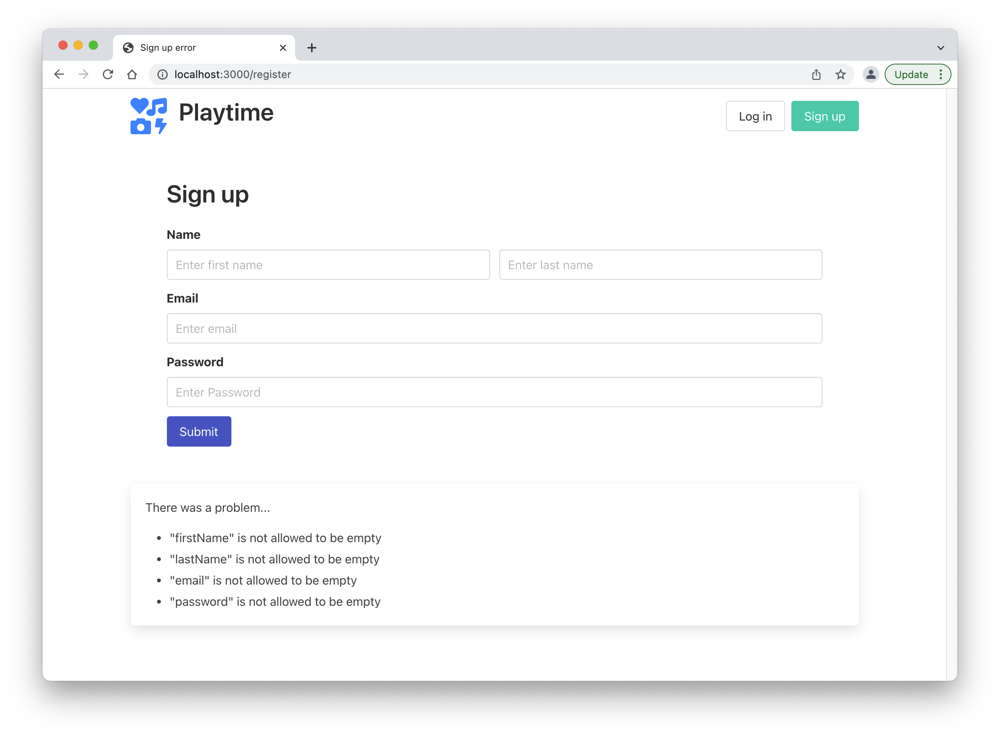

# Joi Error Reporting

We can improve the UX by reporting to the user specifically what fields were problematic. Joi can generate human readable errors - so we need a way to render them as needed.

First, a simple partial to list errors:

## error.hbs

~~~handlebars
{{#if errors}}
  

    
 There was a problem... 

    <ul>
      {{#each errors}}
        <li>{{message}}</li>
      {{/each}}
    </ul>
  

{{/if}}
~~~

We can include this on all view by appending to the main layout:

## layout.hbs

~~~handlebars
<!DOCTYPE html>
<html>
  <head>
    <meta charset="utf-8">
    <meta name="viewport" content="width=device-width, initial-scale=1">
    <title>{{title}}</title>
    <link rel="stylesheet" href="https://cdn.jsdelivr.net/npm/bulma@0.9.3/css/bulma.min.css">
    
  </head>
  <body>
    

      {{{content}}}
      {{> error }}
    

  </body>
</html>
~~~

It will only render if errors are passed.

Back in the `signup` action, we can pass errors to the from joi to the view:

~~~javascript
    validate: {
      payload: UserSpec,
      failAction: function (request, h, error) {
        return h.view("signup-view", { title: "Sign up error", errors: error.details }).takeover().code(400);
      },
    },
~~~

We should now have errors reported:

If we would like to see all errors, we can set an `abortEarly` option to false:

~~~javascript
    validate: {
      payload: UserSpec,
      options: { abortEarly: false },
      failAction: function(request, h, error) {
        return h.view("signup-view", { title: "Sign up error", errors: error.details }).takeover().code(400);
      },
    },
~~~

This should now display all errors:

