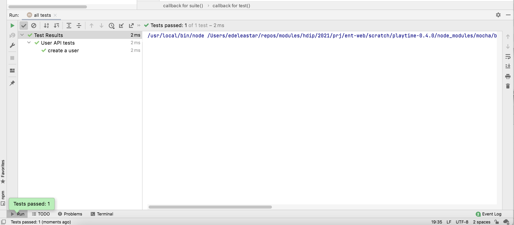
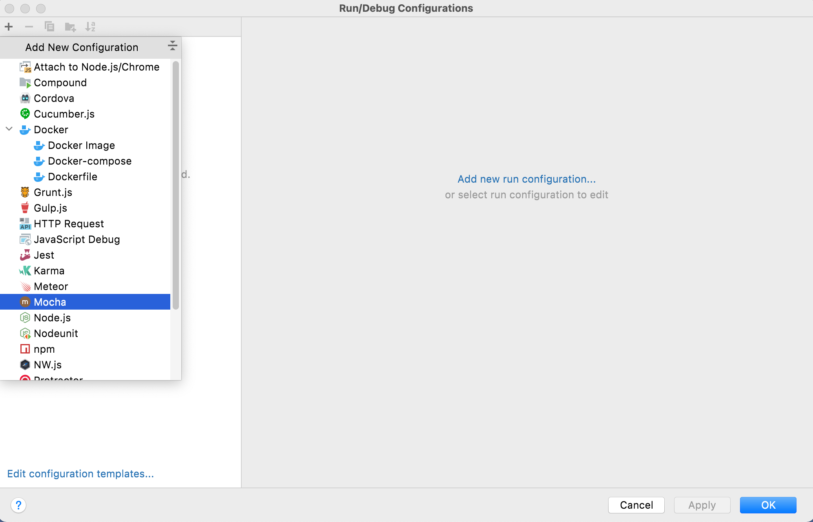
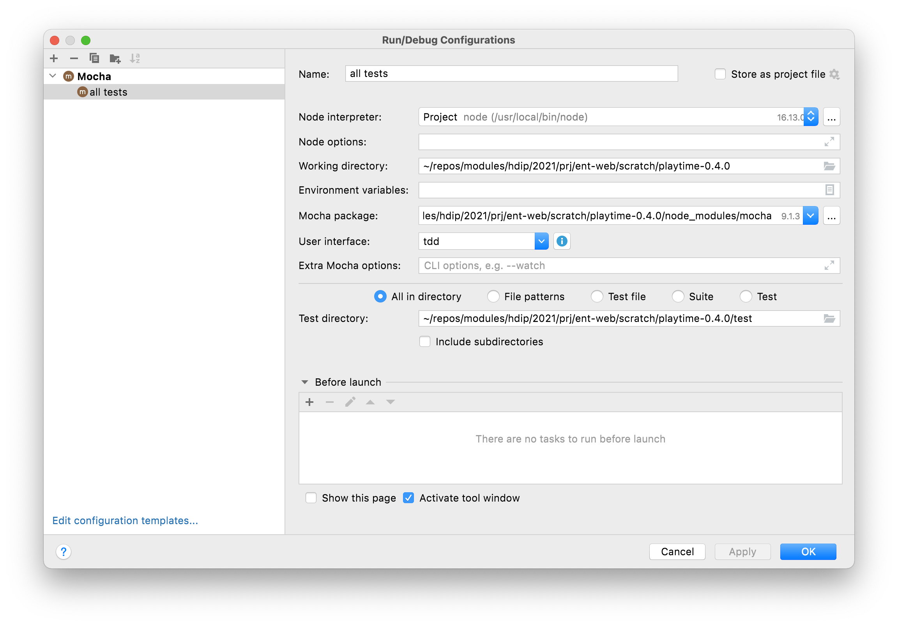
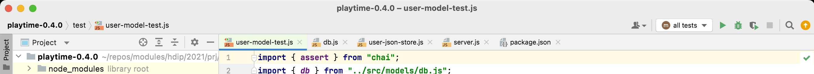
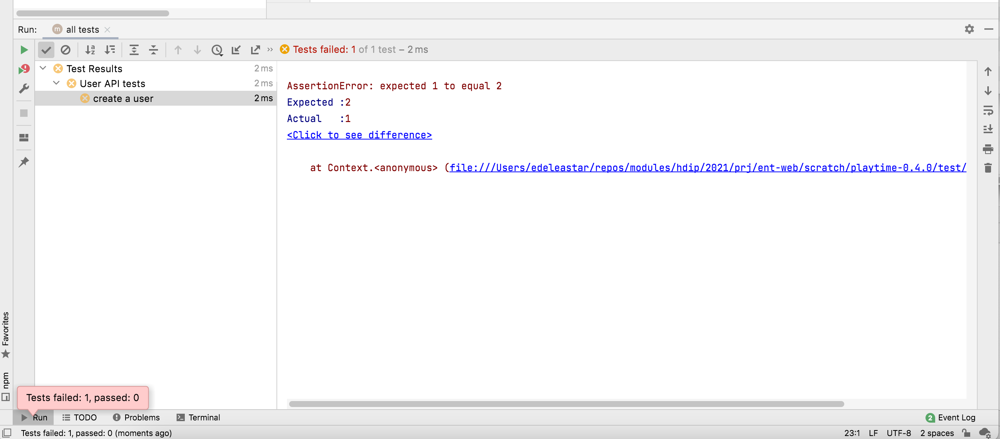
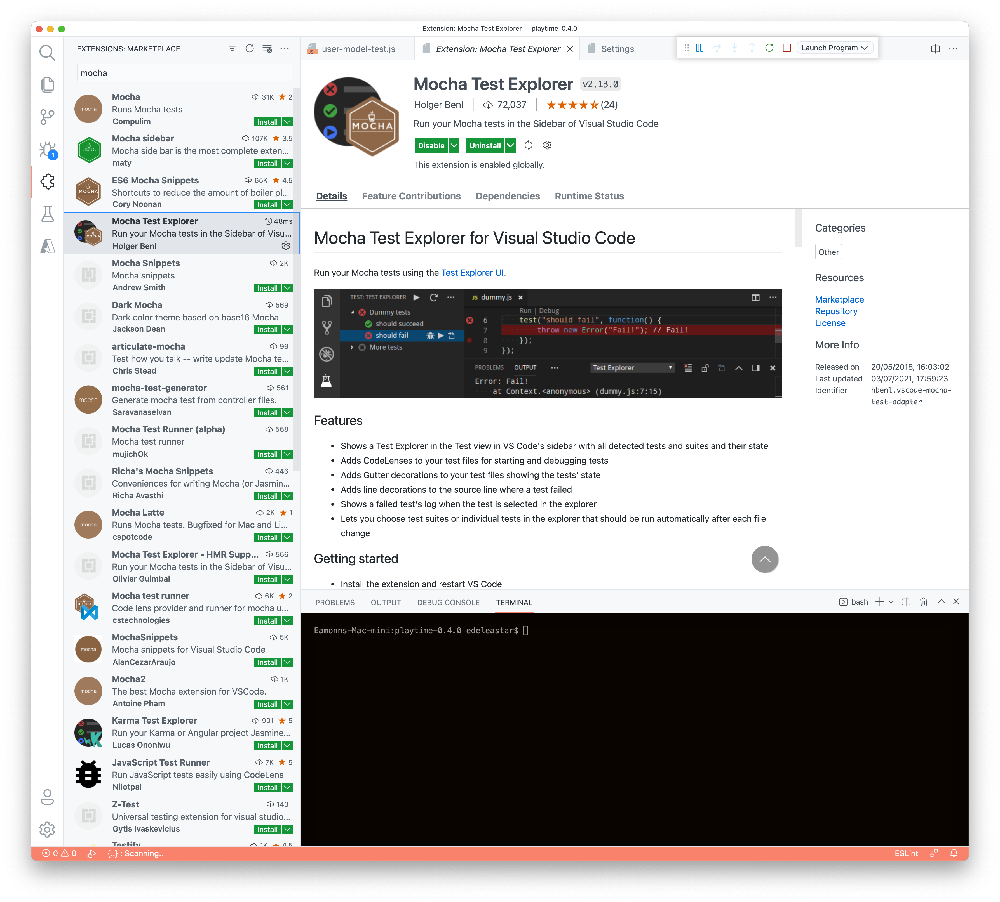
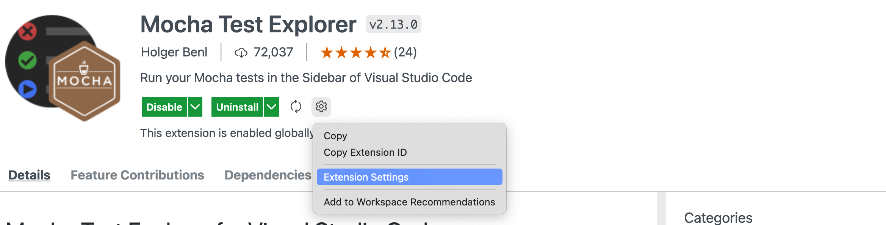
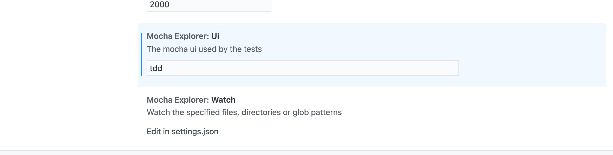
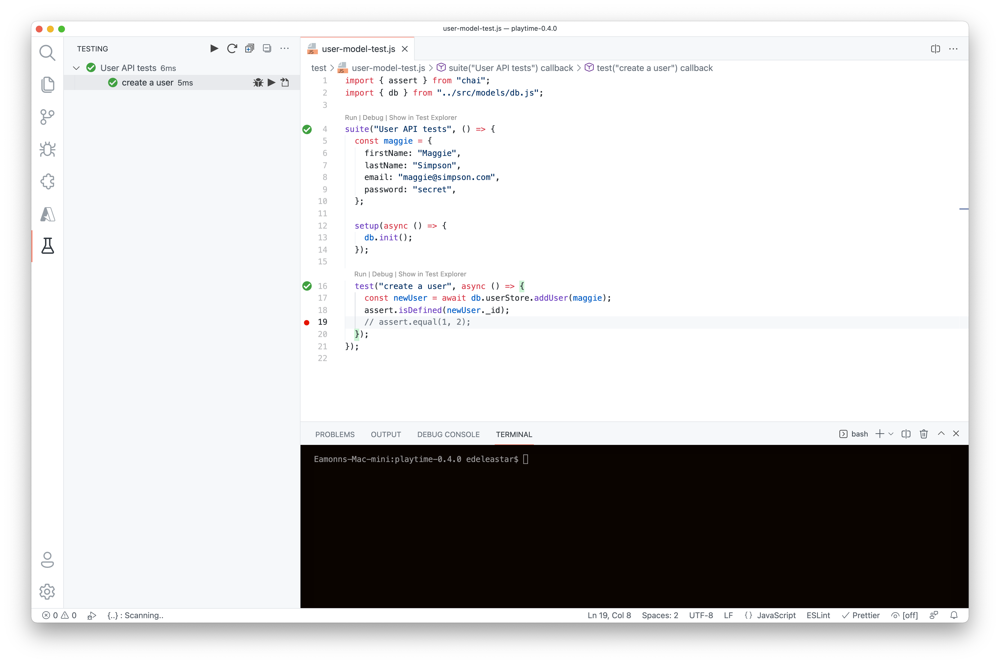

# IDE Mocha Test Runners

The command line is adequate for running tests, but IDEs come with more convenient and attractive  ways of running these type of tests. 

## WebStorm

In WebStorm, this would look like this:

To get this to work, click `Create Configurations` from the toolbar, which opens this dialog:

Select `+` - then add Mocha:

Create  profile - called `all tests` as shown. Pay close attention to 

- User Interface: select`tdd`
- Test directory: select the test folder within the project

Save the above settings. You can now run the tests by pressing the `all test` and pressing green `Run all-tests` button :

## VSCode

VSCode requires an extension to be added. There are many Mocha extensions in the MarketPlace, but someof these have not been updated in recent years, and will not work with a modern application.

The Mocha Test Explorer shown below will work (with a configuration change):

Install the plugin - and once installed select the plugin settings:

Locate the `Mocha Explorer: UI` , and enter a`tdd` - the default may have been `add`

We are again selecting `TDD` as the default UI.

After restarting the IDE, and opening our project, a new `lab` icon will appear on the left margin - and we can run our tests:

