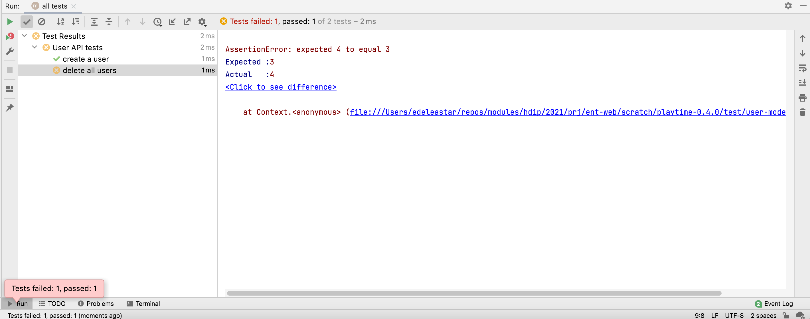
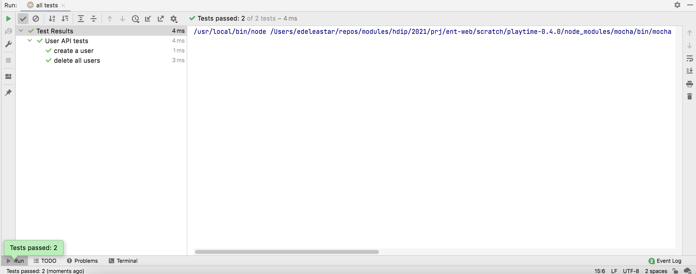
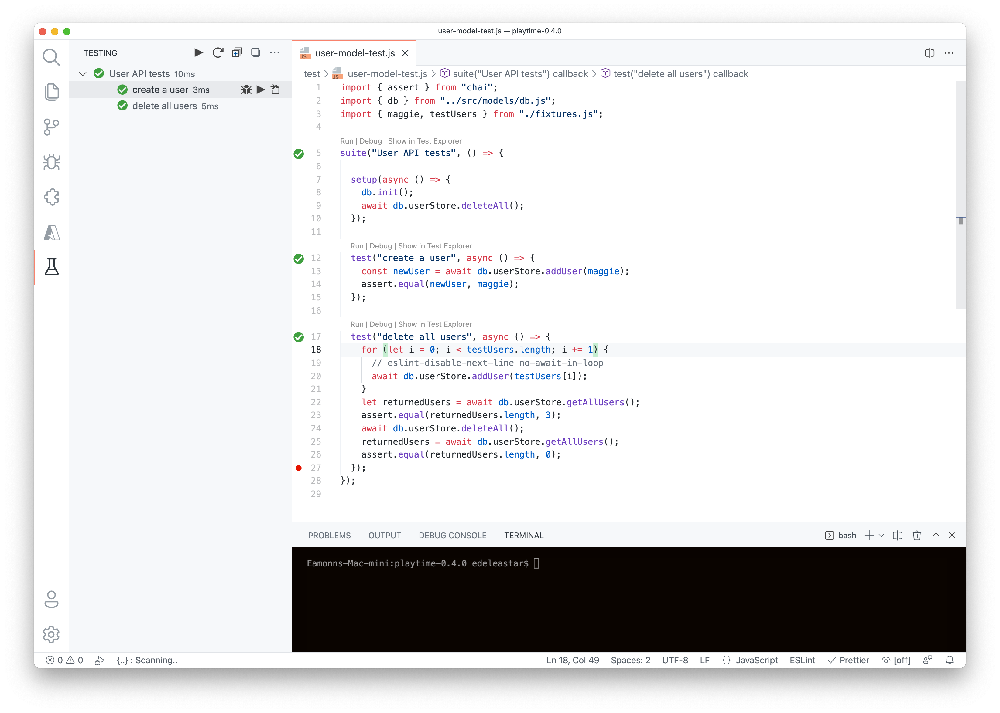

# Create/Delete user tests

We have a "create a user" test:

###  user-model-test.js

~~~javascript
import { assert } from "chai";
import { db } from "../src/models/db.js";

suite("User API tests", () => {
  const maggie = {
    firstName: "Maggie",
    lastName: "Simpson",
    email: "maggie@simpson.com",
    password: "secret",
  };

  setup(async () => {
    db.init();
  });

  test("create a user", async () => {
    const newUser = await db.userStore.addUser(maggie);
    assert.deepEqual(maggie, newUser)
  });
});
~~~

In order to make the tests more manageable - we defined a new module called `fixtures.js` to hold any test data:

### fixtures.js

~~~javascript
export const maggie = {
  firstName: "Maggie",
  lastName: "Simpson",
  email: "maggie@simpson.com",
  password: "secret",
};
~~~

The test can simplify our user test:

~~~javascript
import { assert } from "chai";
import { db } from "../src/models/db.js";
import { maggie } from "./fixtures.js";

suite("User API tests", () => {

  setup(async () => {
    db.init();
  });

  test("create a user", async () => {
    const newUser = await db.userStore.addUser(maggie);
    assert.equal(newUser, maggie);
  });
});
~~~

### Test Delete Users

First include additional test fixtures:

### fixtures.js

~~~javascript
export const maggie = {
  firstName: "Maggie",
  lastName: "Simpson",
  email: "maggie@simpson.com",
  password: "secret",
};

export const testUsers = [
  {
    firstName: "Homer",
    lastName: "Simpson",
    email: "homer@simpson.com",
    password: "secret",
  },
  {
    firstName: "Marge",
    lastName: "Simpson",
    email: "marge@simpson.com",
    password: "secret",
  },
  {
    firstName: "Bart",
    lastName: "Simpson",
    email: "bart@simpson.com",
    password: "secret",
  },
];
~~~

Back in our tests, we can introduce this new test:

###  user-model-test.js

~~~javascript
...
import { maggie, testUsers } from "./fixtures.js";
...

  test("delete all users", async () => {
    for (let i = 0; i < testUsers.length; i += 1) {
      // eslint-disable-next-line no-await-in-loop
      await db.userStore.addUser(testUsers[i]);
    }
    let returnedUsers = await db.userStore.getAllUsers();
    assert.equal(returnedUsers.length, 3);
    await db.userStore.deleteAll();
    returnedUsers = await db.userStore.getAllUsers();
    assert.equal(returnedUsers.length, 0);
  });
~~~

Running the test will most likely fail:

The reason for the failure is test isolation - the previous time we ran the test there were already some users in the data store. This confused our test making it unreliable. Each test should generally start from an empty data store. We can do this by deleting all user before each test is run:

~~~javascript
  setup(async () => {
    db.init();
    await db.userStore.deleteAll();
  });
~~~

