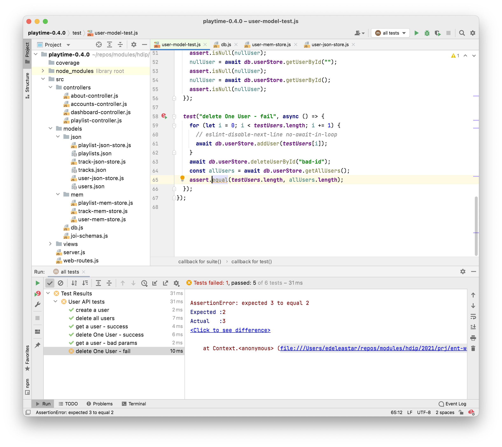

# Exhaustive Tests

We probe further the user model more tests

~~~javascript
  test("get a user - failures", async () => {
    const noUserWithId = await db.userStore.getUserById("123");
    assert.isNull(noUserWithId);
    const noUserWithEmail = await db.userStore.getUserByEmail("no@one.com");
    assert.isNull(noUserWithEmail);
  });
~~~

And this:

~~~javascript
  test("get a user - bad params", async () => {
    let nullUser = await db.userStore.getUserByEmail("");
    assert.isNull(nullUser);
    nullUser = await db.userStore.getUserById("");
    assert.isNull(nullUser);
    nullUser = await db.userStore.getUserById();
    assert.isNull(nullUser);
  });
~~~

Both these tests should pass, and should increase the confidence we can have in our model.

Now try this one:

~~~javascript
  test("delete One User - fail", async () => {
    for (let i = 0; i < testUsers.length; i += 1) {
      // eslint-disable-next-line no-await-in-loop
      await db.userStore.addUser(testUsers[i]);
    }
    await db.userStore.deleteUserById("bad-id");
    const allUsers = await db.userStore.getAllUsers();
    assert.equal(testUsers.length, allUsers.length);
  });
~~~

The test fails:

It seems we have a problem with the deleteUserById function:

~~~javascript
    await db.userStore.deleteUserById("bad-id");
    const allUsers = await db.userStore.getAllUsers();
    assert.equal(testUsers.length, allUsers.length);
~~~

We are trying to delete a user that doesn't exist - expecting there to be no change in the overall number of users. However, it seems that a user is being removed!

This is the problematic method in the user store:

~~~javascript
  async deleteUserById(id) {
    await db.read();
    const index = db.data.users.findIndex((user) => user._id === id);
    db.data.users.splice(index, 1);
    await db.write();
  },
~~~

Although we are using the [splice](https://developer.mozilla.org/en-US/docs/Web/JavaScript/Reference/Global_Objects/Array/splice) method correctly - we are not properly checking the result of findIndex. Specifically for the case when a user is not present in the array. Here is the fix:

~~~javascript
  async deleteUserById(id) {
    await db.read();
    const index = db.data.users.findIndex((user) => user._id === id);
    if (index !== -1) db.data.users.splice(index, 1);
    await db.write();
  },
~~~

Index returns -1 if no match found - so we make sure to not call splice in that case.

It may be worth reflecting on the above test for a moment. Our existing UX did not have a feature to enable us to test this aspect of the application - and yet it harboured a serious bug. This is typical of the benefits of engaging with TDD - we are able to evolve cars aspects of our application in advance of building UX to exercises these aspects. Thus, when we come to build the UX the foundation is likely to be more robust. 

