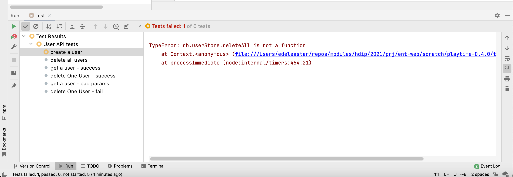
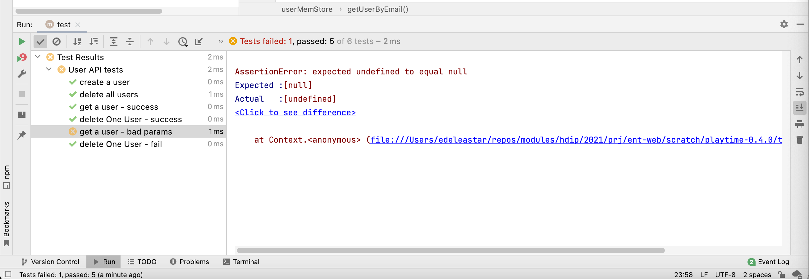
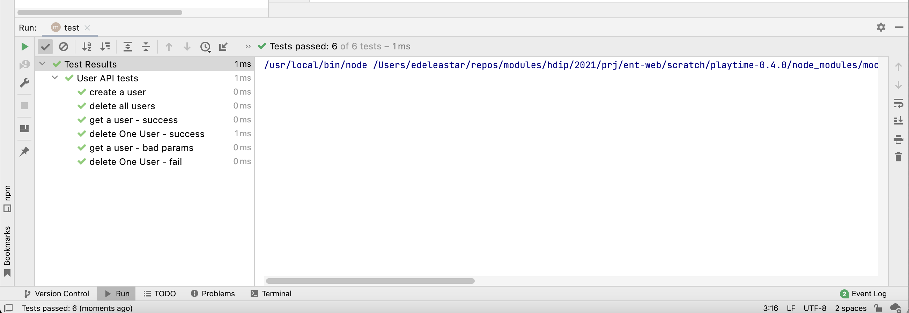

# Exercises

### Exercise 01: 

Make the changes to enable the tests to exercise the Memory store users module. Fix any issues in user-mem-store that might arise.

### Solution:

To make it more convenient to switch stores, we rework db.init() method to take a parameter (a string), which will determine which store to select:

### db.js

~~~javascript
import { userMemStore } from "./mem/user-mem-store.js";
import { playlistMemStore } from "./mem/playlist-mem-store.js";
import { trackMemStore } from "./mem/track-mem-store.js";
import { userJsonStore } from "./json/user-json-store.js";
import { playlistJsonStore } from "./json/playlist-json-store.js";
import { trackJsonStore } from "./json/track-json-store.js";

export const db = {
  userStore: null,
  playlistStore: null,
  trackStore: null,

  init(storeType) {
    switch (storeType) {
      case "json":
        this.userStore = userJsonStore;
        this.playlistStore = playlistJsonStore;
        this.trackStore = trackJsonStore;
        break;
      default:
        this.userStore = userMemStore;
        this.playlistStore = playlistMemStore;
        this.trackStore = trackMemStore;
    }
  },
};
~~~

In user-model-test.js, we can then determine the model we want to use:

### user-model-test.js:

~~~javascript
...
  setup(async () => {
    db.init("json");
    ...
  });
...  
~~~

The tests should all run correctly. 

Now try:

~~~javascript
...
  setup(async () => {
    db.init();
    ...
  });
... 
~~~

This will drive our tests through the Mem store class (the default). This time some tests will fail:

The first failure is in fact closer to a compilation error - if Javascript had been a strongly typed language (like Java). Our tests assume that the userStore has a member `deleteAll()`. In fact we have called it `deleteAllUsers()`. Change to `deleteAll()` and run the tests again:

 

This is a bug we have seen before - here is a replacement for the getUserByEmail and getUserById methods:

### user-model-test.js

~~~javascript
  async getUserById(id) {
    let u = users.find((user) => user._id === id);
    if (u === undefined) u = null;
    return u;
  },

  async getUserByEmail(email) {
    let u = users.find((user) => user.email === email);
    if (u === undefined) u = null;
    return u;
  },
~~~

The tests should work now:

Our tests have plaid an important role here:

- Exposing a control path we had not checked (deleteAll())
- Exposed a set of bugs we were unaware of

Had we not had tests, these issues may first have surfaced via the UX.
