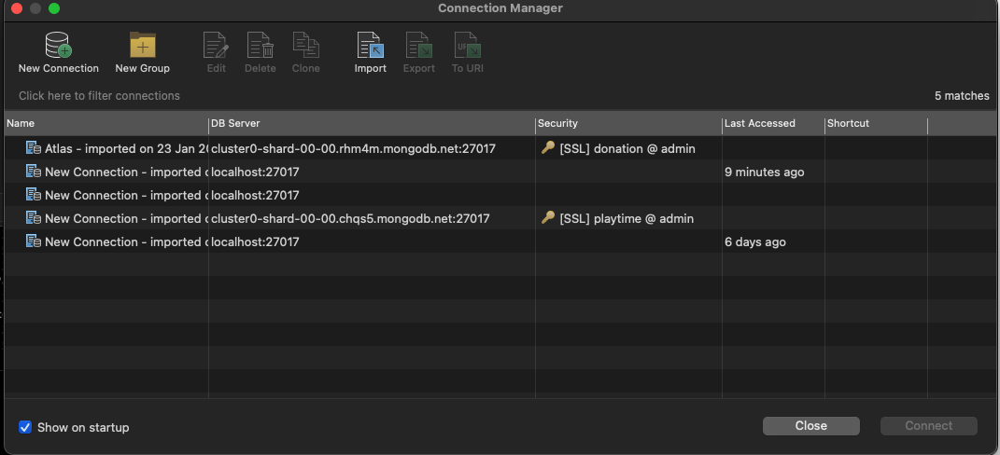
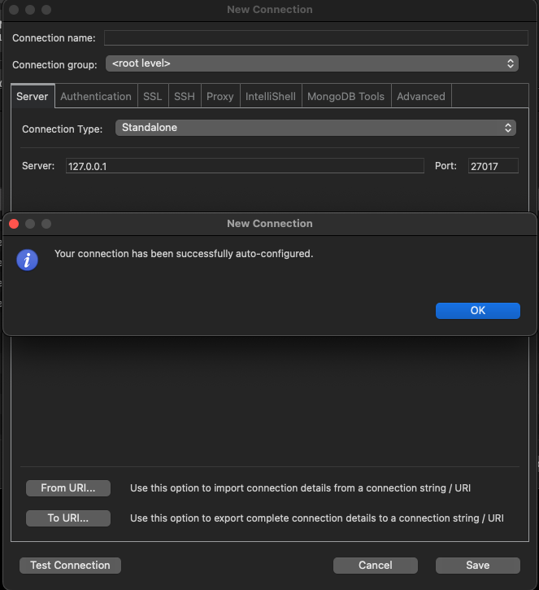
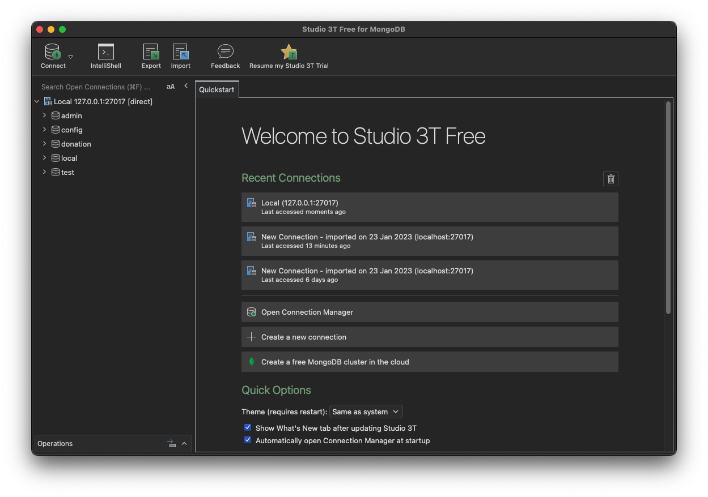

# Mongo + Robo 3T install

If you do not have MongoDB installed, visit the following site, locate the installation for your platform and install the MongoDB application:

- <https://www.mongodb.org>

A suitable distribution from here should suffice:

- <https://www.mongodb.com/download-center/community>

Additionally, install this graphical administration app for Mongo called Robo 3T:

- <https://robomongo.org>

Typically, to launch the mongodb database service on your platform, first create a directory somewhere to store the database itself:

~~~bash
mkdir db
~~~

Then enter the following command to launch the service:

~~~bash
mongod -dbpath db
~~~

Running the above should display startup log on the console:

~~~bash
{"t":{"$date":"2021-12-17T19:18:48.545+00:00"},"s":"I",  "c":"NETWORK",  "id":51800,   "ctx":"conn4","msg":"client metadata","attr":{"remote":"127.0.0.1:62780","client":"conn4","doc":{"driver":{"name":"nodejs|Mongoose","version":"4.2.2"},"os":{"type":"Darwin","name":"darwin","architecture":"arm64","version":"21.1.0"},"platform":"Node.js v16.13.0, LE (unified)","version":"4.2.2|6.1.2"}}}
{"t":{"$date":"2021-12-17T19:18:48.545+00:00"},"s":"I",  "c":"NETWORK",  "id":51800,   "ctx":"conn3","msg":"client metadata","attr":{"remote":"127.0.0.1:62779","client":"conn3","doc":{"driver":{"name":"nodejs|Mongoose","version":"4.1.4"},"os":{"type":"Darwin","name":"darwin","architecture":"arm64","version":"21.1.0"},"platform":"Node.js v16.13.0, LE (unified)","version":"4.1.4|6.0.14"}}}
~~~

Now launch Robo 3T and select `File->Connect`:

Press `New Connection` - and the paste in this connection string:

~~~
mongodb://127.0.0.1:27017/
~~~

This will establish a default connection to the service you just started:

You will be able to navigate the various databases you create, issuing simple queries and browsing the database structure and content.