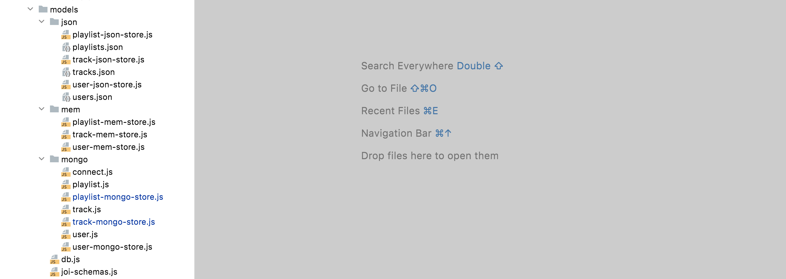
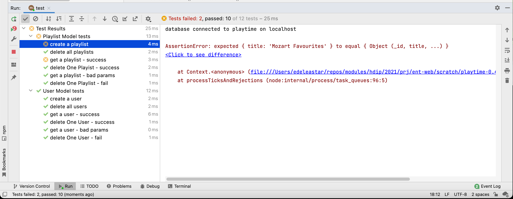
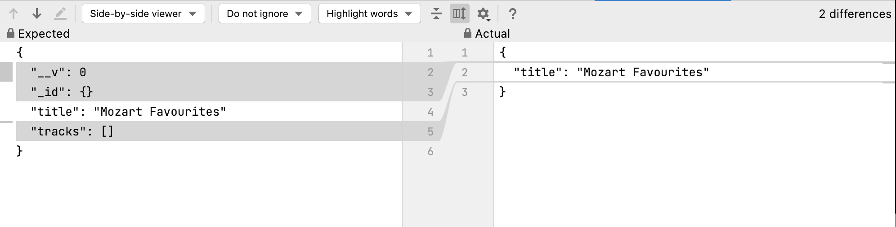
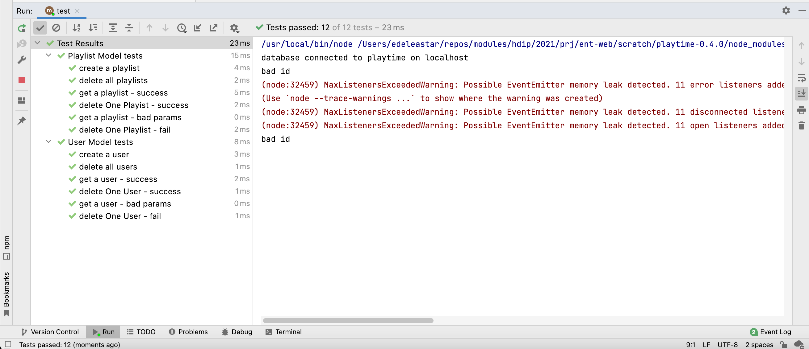

# Track & Playlist

Below are Mongo Schemas for track and playlist:

## track.js

~~~javascript
import Mongoose from "mongoose";

const { Schema } = Mongoose;

const trackSchema = new Schema({
  title: String,
  artist: String,
  duration: Number,
  playlistid: {
    type: Schema.Types.ObjectId,
    ref: "Playlist",
  },
});

export const Track = Mongoose.model("Track", trackSchema);
~~~

## playlist.js

~~~javascript
import Mongoose from "mongoose";

const { Schema } = Mongoose;

const playlistSchema = new Schema({
  title: String,
  userid: {
    type: Schema.Types.ObjectId,
    ref: "User",
  },
});

export const Playlist = Mongoose.model("Playlist", playlistSchema);
~~~

These schemas are then adapted for use by our application via store objects. This is the playlist store adapter:

## playlist-mongo-store.js

~~~javascript
import { Playlist } from "./playlist.js";
import { trackMongoStore } from "./track-mongo-store.js";

export const playlistMongoStore = {
  async getAllPlaylists() {
    const playlists = await Playlist.find().lean();
    return playlists;
  },

  async getPlaylistById(id) {
    if (id) {
      const playlist = await Playlist.findOne({ _id: id }).lean();
      if (playlist) {
        playlist.tracks = await trackMongoStore.getTracksByPlaylistId(playlist._id);
      }
      return playlist;
    }
    return null;
  },

  async addPlaylist(playlist) {
    const newPlaylist = new Playlist(playlist);
    const playlistObj = await newPlaylist.save();
    return this.getPlaylistById(playlistObj._id);
  },

  async getUserPlaylists(id) {
    const playlist = await Playlist.find({ userid: id }).lean();
    return playlist;
  },

  async deletePlaylistById(id) {
    try {
      await Playlist.deleteOne({ _id: id });
    } catch (error) {
      console.log("bad id");
    }
  },

  async deleteAllPlaylists() {
    await Playlist.deleteMany({});
  }
};
~~~

This is an (incomplete for the moment) track-mongo-store.js implementation.

## track-mongo-store.js

~~~javascript
import { Track } from "./track.js";

export const trackMongoStore = {
  async getTracksByPlaylistId(id) {
    const tracks = await Track.find({ playlistid: id }).lean();
    return tracks;
  },
};
~~~

Our model subsystem is now taking shape:

We already have a set of tests for playlist. We can change the setup method to attach the the mongo models:

## playlist-model-test.js

~~~javascript
  setup(async () => {
    db.init("mongo");
    ...
  });
~~~

We must also wire up the mongo play store in db.js:

### db.js

~~~javascript
...
import { playlistMongoStore } from "./mongo/playlist-mongo-store.js";

export const db = {
  userStore: null,
  playlistStore: null,
  trackStore: null,

  init(storeType) {
    switch (storeType) {
      case "json":
        this.userStore = userJsonStore;
        this.playlistStore = playlistJsonStore;
        this.trackStore = trackJsonStore;
        break;
      case "mongo":
        this.userStore = userMongoStore;
        this.playlistStore = playlistMongoStore;
        connectMongo();
        break;
      default:
        this.userStore = userMemStore;
        this.playlistStore = playlistMemStore;
        this.trackStore = trackMemStore;
    }
  },
};

~~~

Running our tests now:

These failures relate to the extra data returned from mongo:

These are the revised assertions :

~~~javascript
    // assert.equal(mozart, playlist);    
    assertSubset(mozart, playlist);
~~~

Change the occurrences of the above in PlaylistModel tests and rerun:

The time spent on creating playlist tests is starting to pay off now - we have some confidence that our playlist-mongo model is behaving at least as robustly as the men and json store versions.

The command line version of the tests will be showing some noisy warnings related to memory leaks:

~~~text
> playtime@0.5.0 test
> ./node_modules/mocha/bin/_mocha --ui tdd test/**.js

  Playlist Model tests
    ✔ create a playlist
    ✔ delete all playlists
    ✔ get a playlist - success
    ✔ delete One Playist - success
    ✔ get a playlist - bad params
bad id
    ✔ delete One Playlist - fail

  User Model tests
    ✔ create a user
    ✔ delete all userApi
    ✔ get a user - success
    ✔ delete One User - success
(node:26351) MaxListenersExceededWarning: Possible EventEmitter memory leak detected. 11 error listeners added to [NativeConnection]. Use emitter.setMaxListeners() to increase limit
(Use `node --trace-warnings ...` to show where the warning was created)
(node:26351) MaxListenersExceededWarning: Possible EventEmitter memory leak detected. 11 disconnected listeners added to [NativeConnection]. Use emitter.setMaxListeners() to increase limit
    ✔ get a user - bad params
(node:26351) MaxListenersExceededWarning: Possible EventEmitter memory leak detected. 11 open listeners added to [NativeConnection]. Use emitter.setMaxListeners() to increase limit
bad id
    ✔ delete One User - fail

  12 passing (195ms)
~~~

These are occurring due to the way mocha is running each test, and we can safely suppress in the tests (any one test will do):

### Playlist-model-test.js

~~~
import { EventEmitter } from "events";
...
EventEmitter.setMaxListeners(25);
~~~

This should generate a cleaner report:

~~~text
> playtime@0.5.0 test
> ./node_modules/mocha/bin/_mocha --ui tdd test/**.js

  Playlist Model tests
    ✔ create a playlist
    ✔ delete all playlists
    ✔ get a playlist - success
    ✔ delete One Playist - success
    ✔ get a playlist - bad params
bad id
    ✔ delete One Playlist - fail

  User Model tests
    ✔ create a user
    ✔ delete all userApi
    ✔ get a user - success
    ✔ delete One User - success
    ✔ get a user - bad params
bad id
    ✔ delete One User - fail

  12 passing (194ms)
~~~

