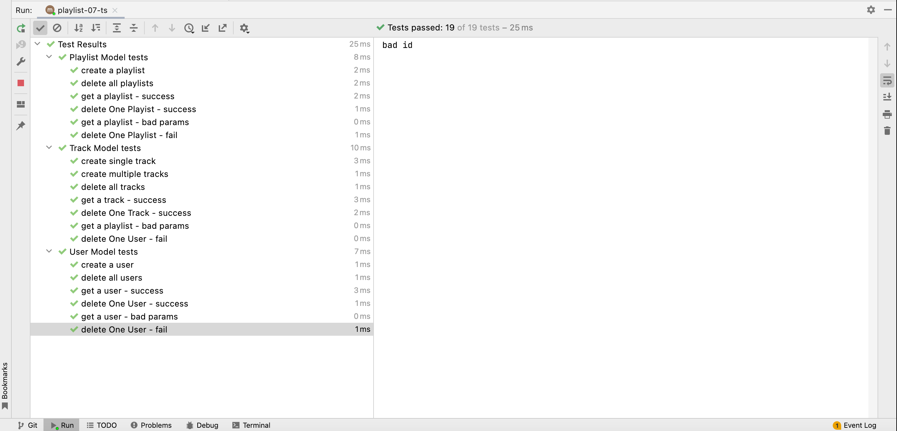

# Exercise 01

The current track-mongo-model is partially complete:

~~~javascript
import { Track } from "./track.js";

export const trackMongoStore = {
  async getTracksByPlaylistId(id) {
    const tracks = await Track.find({ playlistid: id }).lean();
    return tracks;
  },
};
~~~

Complete this now, but do so in conjunction with a set of Track model tests. You can base these tests on the existing playlist tests.

### Solution:

### track-mongo-store.js

~~~javascript
import { Track } from "./track.js";

export const trackMongoStore = {
  async getAllTracks() {
    const tracks = await Track.find().lean();
    return tracks;
  },

  async addTrack(playlistId, track) {
    track.playlistid = playlistId;
    const newTrack = new Track(track);
    const trackObj = await newTrack.save();
    return this.getTrackById(trackObj._id);
  },

  async getTracksByPlaylistId(id) {
    const tracks = await Track.find({ playlistid: id }).lean();
    return tracks;
  },

  async getTrackById(id) {
    if (id) {
      const track = await Track.findOne({ _id: id }).lean();
      return track;
    }
    return null;
  },

  async deleteTrack(id) {
    try {
      await Track.deleteOne({ _id: id });
    } catch (error) {
      console.log("bad id");
    }
  },

  async deleteAllTracks() {
    await Track.deleteMany({});
  },

  async updateTrack(track, updatedTrack) {
    track.title = updatedTrack.title;
    track.artist = updatedTrack.artist;
    track.duration = updatedTrack.duration;
    await track.save();
  },
};
~~~

### db.js
~~~javascript
...
import { trackMongoStore } from "./mongo/track-mongo-store.js";
...
this.trackStore = trackMongoStore;
~~~

### fixtures.js

~~~javascript
export const maggie = {
  firstName: "Maggie",
  lastName: "Simpson",
  email: "maggie@simpson.com",
  password: "secret"
};

export const testUsers = [
  {
    firstName: "Homer",
    lastName: "Simpson",
    email: "homer@simpson.com",
    password: "secret"
  },
  {
    firstName: "Marge",
    lastName: "Simpson",
    email: "marge@simpson.com",
    password: "secret"
  },
  {
    firstName: "Bart",
    lastName: "Simpson",
    email: "bart@simpson.com",
    password: "secret"
  }
];

export const mozart = {
  title: "Mozart Favourites"
};

export const concerto = {
  "title": "Violin Concerto No. 3",
  "artist": "Mozart",
  "duration": 15
};

export const beethoven = {
  title: "Mozart Favourites"
};

export const testPlaylists = [
  {
    title: "Beethoven Sonatas"
  },
  {
    title: "Beethoven Concertos"
  },
  {
    title: "Beethoven Symphonies"
  }
];

export const testTracks = [
  {
    "title": "Piano Sonata No. 3",
    "artist": "Beethoven",
    "duration": 5
  },
  {
    "title": "Piano Sonata No. 7",
    "artist": "Beethoven",
    "duration": 6
  },
  {
    "title": "Piano Sonata No. 10",
    "artist": "Beethoven",
    "duration": 4
  }
];
~~~

### track-model-tests.js

~~~javascript
import { assert } from "chai";
import { db } from "../src/models/db.js";
import { testPlaylists, testTracks, beethoven, mozart, concerto, testUsers } from "./fixtures.js";
import { assertSubset } from "./test-utils.js";

suite("Track Model tests", () => {

  let beethovenList = null;

  setup(async () => {
    db.init("mongo");
    await db.playlistStore.deleteAllPlaylists();
    await db.trackStore.deleteAllTracks();
    beethovenList = await db.playlistStore.addPlaylist(beethoven);
    for (let i = 0; i < testTracks.length; i += 1) {
      // eslint-disable-next-line no-await-in-loop
      testTracks[i] = await db.trackStore.addTrack(beethovenList._id, testTracks[i]);
    }
  });

  test("create single track", async () => {
    const mozartList = await db.playlistStore.addPlaylist(mozart);
    const track = await db.trackStore.addTrack(mozartList._id, concerto)
    assert.isNotNull(track._id);
    assertSubset (concerto, track);
  });

  test("get multiple tracks", async () => {
    const tracks = await db.trackStore.getTracksByPlaylistId(beethovenList._id);
    assert.equal(tracks.length, testTracks.length)
  });

  test("delete all tracks", async () => {
    const tracks = await db.trackStore.getAllTracks();
    assert.equal(testTracks.length, tracks.length);
    await db.trackStore.deleteAllTracks();
    const newTracks = await db.trackStore.getAllTracks();
    assert.equal(0, newTracks.length);
  });

  test("get a track - success", async () => {
    const mozartList = await db.playlistStore.addPlaylist(mozart);
    const track = await db.trackStore.addTrack(mozartList._id, concerto)
    const newTrack = await db.trackStore.getTrackById(track._id);
    assertSubset (concerto, newTrack);
  });

  test("delete One Track - success", async () => {
    await db.trackStore.deleteTrack(testTracks[0]._id);
    const tracks = await db.trackStore.getAllTracks();
    assert.equal(tracks.length, testPlaylists.length - 1);
    const deletedTrack = await db.trackStore.getTrackById(testTracks[0]._id);
    assert.isNull(deletedTrack);
  });

  test("get a track - bad params", async () => {
    assert.isNull(await db.trackStore.getTrackById(""));
    assert.isNull(await db.trackStore.getTrackById());
  });

  test("delete one track - fail", async () => {
    await db.trackStore.deleteTrack("bad-id");
    const tracks = await db.trackStore.getAllTracks();
    assert.equal(tracks.length, testPlaylists.length);
  });
});
~~~

### db.js

~~~javascript
import { trackMongoStore } from "./mongo/track-mongo-store.js";
...
case "mongo":
        this.userStore = userMongoStore;
        this.playlistStore = playlistMongoStore;
        this.trackStore = trackMongoStore;
        connectMongo();
        break;
...
~~~

We now have a comprehensive set of tests for our mongo data store:

