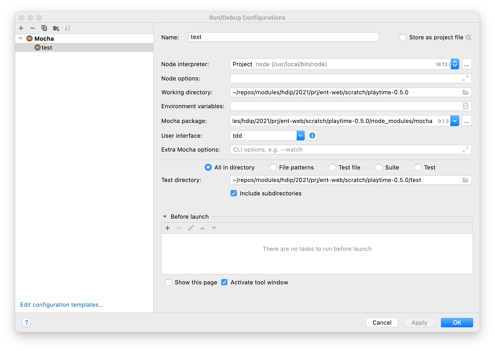

# Refactor Tests

This is the current structure of our tests:

Restructure your tests into the following structure:

We are just moving our model tests into a subfolder. 

If you use the IDE to drag and drop these sources, we would expect the import paths to be updated by the IDE to reflect the relocation. This is the refactoring behaviour built in to most IDEs.

We are about to construct an API for our application, and we will start by scaffolding up some tests of this API in parallel with building out the API itself. These is the structure we are aiming for:

Start with this empty test:

## user-api-test.js

~~~javascript
import { playtimeService } from "./playtime-service.js";

suite("User API tests", () => {
  setup(async () => {
  });
  teardown(async () => {
  });

  test("create a user", async () => {
  });
});
~~~

## playtime-service.js

~~~javascript
export const playtimeService = {

};
~~~

To run all tests we need to make one change to the mocha launch configuration:

Include subdirectories has been checked.

VS Code should continue to work automatically:

For the command line runner to work, we need to change the script in package.json slightly:

### package.json

~~~json
    "test": "./node_modules/mocha/bin/_mocha --ui tdd test/**/*.js -exit"
~~~

The small change at the end is to force it to descend into subdirectories.

If you are on Windows, then:

~~~json
    "test": "mocha --ui tdd test/**/*.js -exit"
~~~

