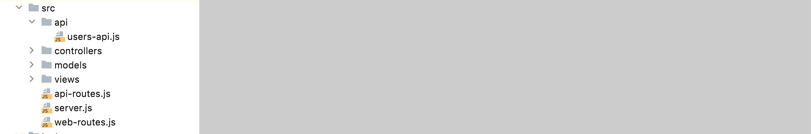

# API Structure

First install the following module:

~~~bash
npm install @hapi/boom
~~~

This is a module that makes retiring HTTP code more convenient - particularly errors:

- <https://hapi.dev/module/boom>

Now, to create an API for our app we will need these two modules initially:

- api-routes.js: a set of routes to service the api
- users-api.js: implementation of the User API

Place this into the project like this:

This is the implementation of our initial Users Endpoints:

## user-api.js

~~~javascript
import Boom from "@hapi/boom";
import { db } from "../models/db.js";

export const userApi = {
  create: {
    auth: false,
    handler: async function(request, h) {
      try {
        const user = await db.userStore.addUser(request.payload);
        if (user) {
          return h.response(user).code(201);
        }
        return Boom.badImplementation("error creating user");
      } catch (err) {
        return Boom.serverUnavailable("Database Error");
      }
    },
  },

  find: {
    auth: false,
    handler: async function(request, h) {
      try {
        const users = await db.userStore.getAllUsers();
        return users;
      } catch (err) {
        return Boom.serverUnavailable("Database Error");
      }
    },
  },
};
~~~

This implements `create` and `deleteAll` endpoints. Notice they are structured very like standard controllers, except the do not rely on the views/vision system.

This are the routes to publish the above endpoints:

## api-routes.js

~~~javascript
import { userApi } from "./api/user-api.js";

export const apiRoutes = [
  { method: "POST", path: "/api/users", config: userApi.create },
  { method: "GET", path: "/api/users", config: userApi.find },
];
~~~

To make these routes available, we import and initialise them in server.js

## server.js

~~~javascript
import { apiRoutes } from "./api-routes.js";

...
  db.init("mongo");
  server.route(webRoutes);
  server.route(apiRoutes);
  await server.start();
...
~~~

Try to launch the app now:

~~~bash
npm run start
~~~

It should start as before. It is now serving both a web interface and an API. We can access part of the API in the browser:

- http://localhost:3000/api/users

This will return any users in the database (perhaps left over from the last run tests):

~~~json
[{"_id":"61c0b2fe97dcdc19fd775a22","firstName":"Homer","lastName":"Simpson","email":"homer@simpson.com","password":"secret","__v":0},{"_id":"61c0b2fe97dcdc19fd775a25","firstName":"Marge","lastName":"Simpson","email":"marge@simpson.com","password":"secret","__v":0},{"_id":"61c0b2fe97dcdc19fd775a28","firstName":"Bart","lastName":"Simpson","email":"bart@simpson.com","password":"secret","__v":0}]
~~~

