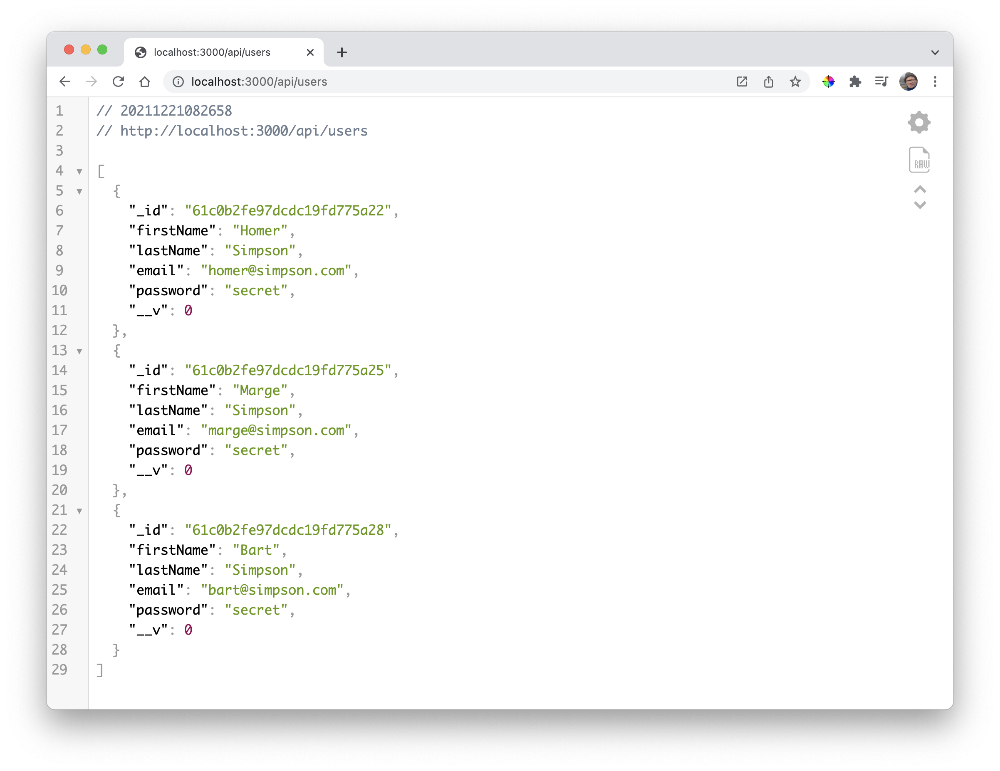
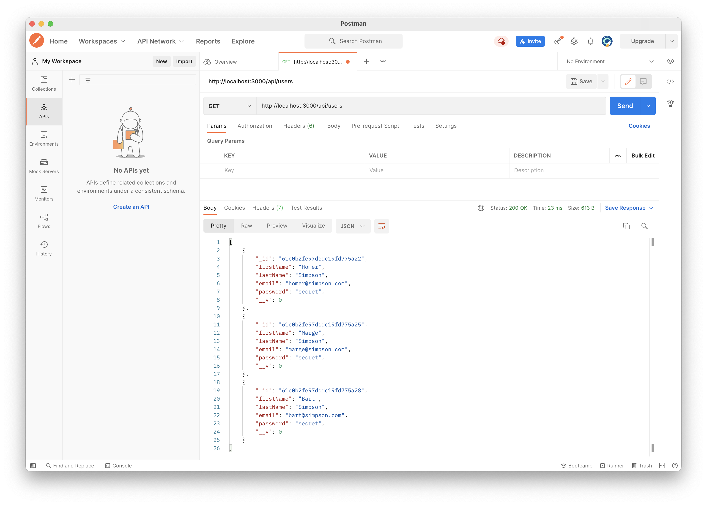
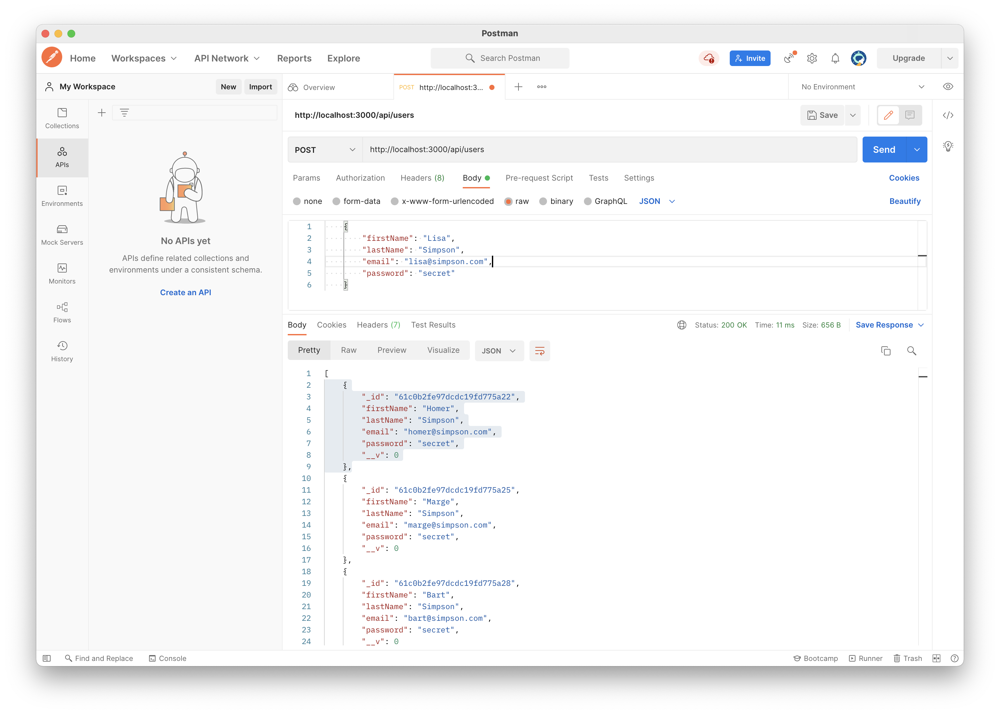
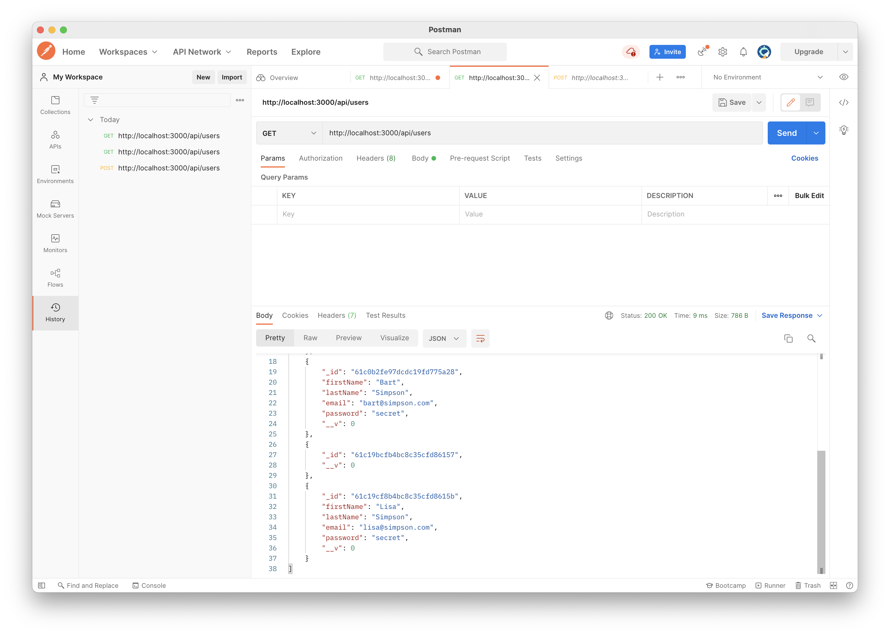

# POST User

We can access the `GET /api/users` endpoint via any browser - displayed using the JSONViewer chrome plugin:

However, accessing `POST /api/users` requires  front end application. Postman is a standard in this area:

- <https://www.postman.com/>

In order generate a request to a locally hosted api, you will need to install the Postman client:

- <https://www.postman.com/downloads/>

This will require sign up / log in - eventually, when you should be able to send the same POST request:

To create a POST request, takes a little more work - see if you can reproduce from the screen shot below:

We have manually entered details for "lisa" in the above as JSON data.

Pressing SEND will create a new user. You can check Robo3T to see if the user has been created.

Pressing `Send` will also return the user with an id as shown in the lower pane above. 

The new user should be part of the returned list if we request all users again.
