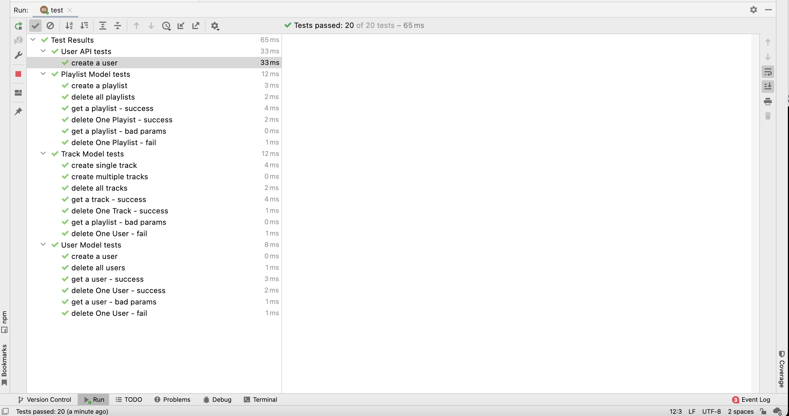

# API Test Case

While POSTMAN and other tools can be very powerful for experimenting with APIs, we already have a tool set that is even more powerful in this context: Unit Tests.

First, we need a HTTP Client library:

~~~bash
npm install -D axios
~~~

Now lets go back to our unit tests:

First, include the url hosting the API in fixtures:

## fixtures.js

~~~javascript
export const serviceUrl = "http://localhost:3000";
~~~

Then we can start to build out playtimeService:

## playtime-service.js

~~~javascript
import axios from "axios";

import { serviceUrl } from "../fixtures.js";

export const playtimeService = {
  playtimeUrl: serviceUrl,

  async createUser(user) {
    const res = await axios.post(`${this.playtimeUrl}/api/users`, user);
    return res.data;
  }
}
~~~

And our first test:

## user-api-test.js

~~~javascript
import { assert } from "chai";
import { playtimeService } from "./playtime-service.js";
import { assertSubset } from "../test-utils.js";
import { maggie } from "../fixtures.js";

suite("User API tests", () => {
  setup(async () => {
  });
  teardown(async () => {
  });

  test("create a user", async () => {
    const newUser = await playtimeService.createUser(maggie);
    assertSubset(maggie, newUser);
    assert.isDefined(newUser._id);
  });
});
~~~

We are now exercising the create user test - just as we did using Postman, but programaically. This offers a more convenient and powerful way of verifying the behaviour of our API as we start to build it further.

Verify that the above test passes.

Note: unlike the unit tests we have devised to date, the above test will require our application to be running (`npm run start`) as we are accessing it over HTTP.

