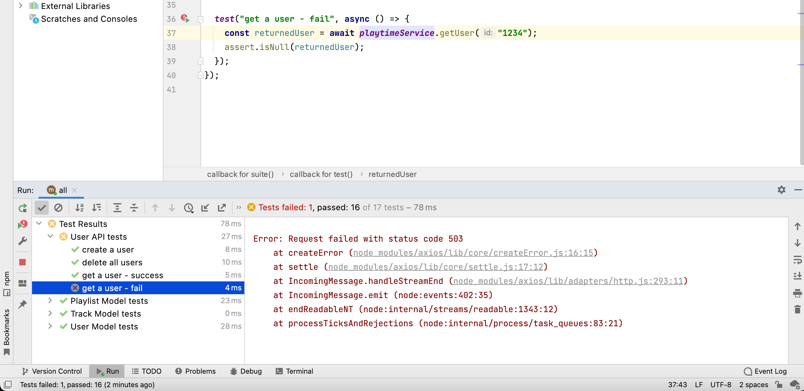

# Exceptions

Lets try one more test:

## users-api-test.js

~~~javascript
  test("get a user - fail", async () => {
    const returnedUser = await playtimeService.getUser("1234");
    assert.isNull(returnedUser);
  });
~~~

This looks reasonable - we are trying to get a non existent user, so we expect null. However, running the test:

The test fails - although we expected it to succeed (we found no user).

Here is a version which should pass:

~~~javascript
  test("get a user - fail", async () => {
    try {
      const returnedUser = await playtimeService.getUser("1234");
      assert.fail("Should not return a response");
    } catch (error) {
      assert(error.response.data.message === "No User with this id");
    }
  });
~~~

We are expecting an exception - it is an error if we do not get one, and we are expecting the exception to have the "No User with this id" message. This exception is generated by the endpoint implementation:

~~~javascript
  findOne: {
    auth: false,
    handler: async function (request, h) {
      try {
        const user = await db.userStore.getUserById(request.params.id);
        if (!user) {
          return Boom.notFound("No User with this id");
        }
        return user;
      } catch (err) {
        return Boom.serverUnavailable("No User with this id");
      }
    },
  },
~~~

Notice that there are 2 paths to returning this error.

Try this test:

~~~javascript
  test("get a user - deleted user", async () => {
    await playtimeService.deleteAllUsers();
    try {
      const returnedUser = await playtimeService.getUser(testUsers[0]._id);
      assert.fail("Should not return a response");
    } catch (error) {
      assert(error.response.data.message === "No User with this id");
    }
  });
~~~

This test also passes (the user we are looking for has been deleted).

Here are revised version of both tests again:

~~~javascript
  test("get a user - bad id", async () => {
    try {
      const returnedUser = await playtimeService.getUser("1234");
      assert.fail("Should not return a response");
    } catch (error) {
      assert(error.response.data.message === "No User with this id");
      assert.equal(error.response.data.statusCode, 503);
    }
  });

  test("get a user - deleted user", async () => {
    await playtimeService.deleteAllUsers();
    try {
      const returnedUser = await playtimeService.getUser(testUsers[0]._id);
      assert.fail("Should not return a response");
    } catch (error) {
      assert(error.response.data.message === "No User with this id");
      assert.equal(error.response.data.statusCode, 404);
    }
  });
~~~

In these versions, we are specifically exercising 2 different execution paths in the `findOne` endpoint :

- A valid id, but no user
- An invalid ID, or the service is not available

These are associated with different HTTP error codes:

- <https://developer.mozilla.org/en-US/docs/Web/HTTP/Status/404>
- https://developer.mozilla.org/en-US/docs/Web/HTTP/Status/503

We are using Boom to encapsulate the creation of these errors:

~~~javascript
...
Boom.notFound("No User with this id");
...
Boom.serverUnavailable("No User with this id");
...
~~~

