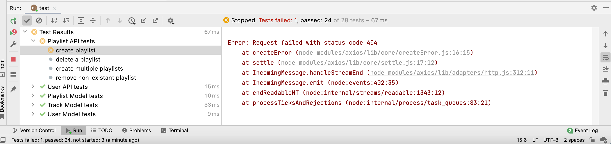
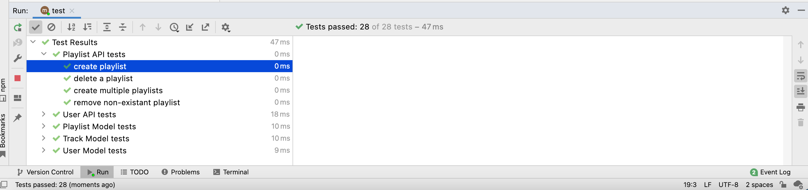

# Playlist Tests

Starting with the playlist-api-test, import some fixtures:

### playlist-api-test.js

~~~javascript
...
import { maggie, mozart, testPlaylists } from "../fixtures.js";
...
~~~

In setup, we can configure these fixtures:

~~~javascript
...
suite("Playlist API tests", () => {

  let user = null;

  setup(async () => {
    await playtimeService.deleteAllPlaylists();
    await playtimeService.deleteAllUsers();
    user = await playtimeService.createUser(maggie);
    mozart.userid = user._id;
  });
 ...
~~~

We could try to run all tests now:

If you get a 404 error as show above, this likely because either your playtime app is not running, or is still running the previous version (before we introduce the new playlist api routes). Run the app again:

~~~bash
^C
npm run start
~~~

... and run the tests:

We are now getting a 500 status code:

- <https://developer.mozilla.org/en-US/docs/Web/HTTP/Status/500>

We have (finally) hit one of our skeleton API endpoints :

~~~javascript
  ...
    await playtimeService.deleteAllPlaylists();
  ...
~~~

### playlist-api.js

~~~javascript
  deleteAll: {
    auth: false,
    handler: async function (request, h) {
    },
  },
~~~

Try this implementation:

~~~javascript
  deleteAll: {
    auth: false,
    handler: async function (request, h) {
      try {
        await db.playlistStore.deleteAllPlaylists();
        return h.response().code(204);
      } catch (err) {
        return Boom.serverUnavailable("Database Error");
      }
    },
  },
~~~

Stop the application - and restart, and then rerun the tests:

Although we have only succeeded in getting our setup method running (strictly speaking not even a test), we are finally ready to start building actual tests.