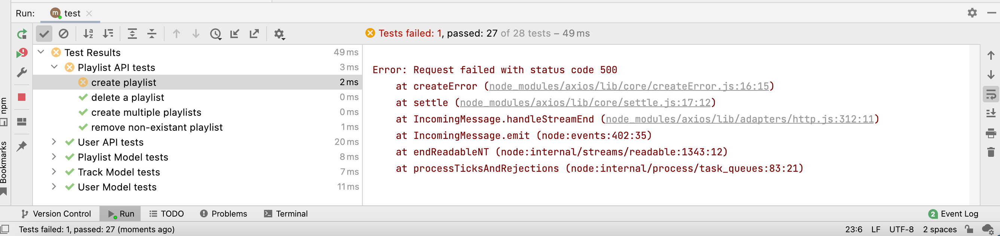
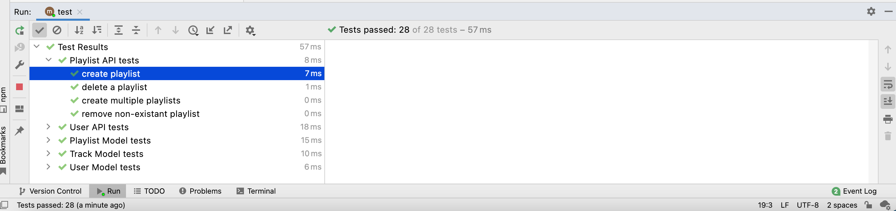

# Playlist API TDD

Start by implementing a test:

#### playlist-api-test.js

~~~javascript
  test("create playlist", async () => {
    const returnedPlaylist = await playtimeService.createPlaylist(mozart);
    assert.isNotNull(returnedPlaylist);
    assertSubset(mozart, returnedPlaylist);
  });
~~~

This test should fail:

Without restarting the server (i.e. relying on nodemon or watch), implement the endpoint we are testing:

#### playlist-api.js

~~~javascript
...
  create: {
    auth: false,
    handler: async function (request, h) {
      try {
        const playlist = request.payload;
        const newPlaylist = await db.playlistStore.addPlaylist(playlist);
        if (newPlaylist) {
          return h.response(newPlaylist).code(201);
        }
        return Boom.badImplementation("error creating playlist");
      } catch (err) {
        return Boom.serverUnavailable("Database Error");
      }
    },
  },
...
~~~

Rerun the test:

This is the TDD method in action:

- Write a test
- Test fails
- Do enough to make test pass
- Reflect on the implementation, perhaps simplify/refactor and re run test
- Test passes again

Try each of these tests / api implementations in sequence applying the above TDD pattern:

### playlist-api-test.js

~~~javascript
  test("delete a playlist", async () => {
    const playlist = await playtimeService.createPlaylist(mozart);
    const response = await playtimeService.deletePlaylist(playlist._id);
    assert.equal(response.status, 204);
    try {
      const returnedPlaylist = await playtimeService.getPlaylist(playlist.id);
      assert.fail("Should not return a response");
    } catch (error) {
      assert(error.response.data.message === "No Playlist with this id", "Incorrect Response Message");
    }
  });
~~~

### playlist-api.js

~~~javascript
  deleteOne: {
    auth: false,
    handler: async function (request, h) {
      try {
        const playlist = await db.playlistStore.getPlaylistById(request.params.id);
        if (!playlist) {
          return Boom.notFound("No Playlist with this id");
        }
        await db.playlistStore.deletePlaylistById(playlist._id);
        return h.response().code(204);
      } catch (err) {
        return Boom.serverUnavailable("No Playlist with this id");
      }
    },
  },
~~~

~~~javascript
  findOne: {
    auth: false,
    async handler(request) {
      try {
        const playlist = await db.playlistStore.getPlaylistById(request.params.id);
        if (!playlist) {
          return Boom.notFound("No Playlist with this id");
        }
        return playlist;
      } catch (err) {
        return Boom.serverUnavailable("No Playlist with this id");
      }
    },
  },
~~~

The above should pass.

Not try these more exhaustive tests:

### playlist-api-test.js

~~~javascript
  test("create multiple playlists", async () => {
    for (let i = 0; i < testPlaylists.length; i += 1) {
      testPlaylists[i].userid = user._id;
      // eslint-disable-next-line no-await-in-loop
      await playtimeService.createPlaylist(testPlaylists[i]);
    }
    let returnedLists = await playtimeService.getAllPlaylists();
    assert.equal(returnedLists.length, testPlaylists.length);
    await playtimeService.deleteAllPlaylists();
    returnedLists = await playtimeService.getAllPlaylists();
    assert.equal(returnedLists.length, 0);
  });

  test("remove non-existant playlist", async () => {
    try {
      const response = await playtimeService.deletePlaylist("not an id");
      assert.fail("Should not return a response");
    } catch (error) {
      assert(error.response.data.message === "No Playlist with this id", "Incorrect Response Message");
    }
  });
~~~

### playlist-api.js

~~~javascript
  find: {
    auth: false,
    handler: async function (request, h) {
      try {
        const playlists = await db.playlistStore.getAllPlaylists();
        return playlists;
      } catch (err) {
        return Boom.serverUnavailable("Database Error");
      }
    },
  },
~~~

## Complete tests + api

At this stage, this is the complete set of tests:

### playlist-api-test.js

~~~javascript
import { assert } from "chai";
import { playtimeService } from "./playtime-service.js";
import { assertSubset } from "../test-utils.js";

import { maggie, mozart, testPlaylists } from "../fixtures.js";

suite("Playlist API tests", () => {

  let user = null;

  setup(async () => {
    await playtimeService.deleteAllPlaylists();
    await playtimeService.deleteAllUsers();
    user = await playtimeService.createUser(maggie);
    mozart.userid = user._id;
  });

  teardown(async () => {});

  test("create playlist", async () => {
    const returnedPlaylist = await playtimeService.createPlaylist(mozart);
    assert.isNotNull(returnedPlaylist);
    assertSubset(mozart, returnedPlaylist);
  });

  test("delete a playlist", async () => {
    const playlist = await playtimeService.createPlaylist(mozart);
    const response = await playtimeService.deletePlaylist(playlist._id);
    assert.equal(response.status, 204);
    try {
      const returnedPlaylist = await playtimeService.getPlaylist(playlist.id);
      assert.fail("Should not return a response");
    } catch (error) {
      assert(error.response.data.message === "No Playlist with this id", "Incorrect Response Message");
    }
  });

  test("create multiple playlists", async () => {
    for (let i = 0; i < testPlaylists.length; i += 1) {
      testPlaylists[i].userid = user._id;
      // eslint-disable-next-line no-await-in-loop
      await playtimeService.createPlaylist(testPlaylists[i]);
    }
    let returnedLists = await playtimeService.getAllPlaylists();
    assert.equal(returnedLists.length, testPlaylists.length);
    await playtimeService.deleteAllPlaylists();
    returnedLists = await playtimeService.getAllPlaylists();
    assert.equal(returnedLists.length, 0);
  });

  test("remove non-existant playlist", async () => {
    try {
      const response = await playtimeService.deletePlaylist("not an id");
      assert.fail("Should not return a response");
    } catch (error) {
      assert(error.response.data.message === "No Playlist with this id", "Incorrect Response Message");
    }
  });
});
~~~

### playlist-api.js

~~~javascript
import Boom from "@hapi/boom";
import { PlaylistSpec } from "../models/joi-schemas.js";
import { db } from "../models/db.js";

export const playlistApi = {
  find: {
    auth: false,
    handler: async function (request, h) {
      try {
        const playlists = await db.playlistStore.getAllPlaylists();
        return playlists;
      } catch (err) {
        return Boom.serverUnavailable("Database Error");
      }
    },
  },

  findOne: {
    auth: false,
    async handler(request) {
      try {
        const playlist = await db.playlistStore.getPlaylistById(request.params.id);
        if (!playlist) {
          return Boom.notFound("No Playlist with this id");
        }
        return playlist;
      } catch (err) {
        return Boom.serverUnavailable("No Playlist with this id");
      }
    },
  },

  create: {
    auth: false,
    handler: async function (request, h) {
      try {
        const playlist = request.payload;
        const newPlaylist = await db.playlistStore.addPlaylist(playlist);
        if (newPlaylist) {
          return h.response(newPlaylist).code(201);
        }
        return Boom.badImplementation("error creating playlist");
      } catch (err) {
        return Boom.serverUnavailable("Database Error");
      }
    },
  },

  deleteOne: {
    auth: false,
    handler: async function (request, h) {
      try {
        const playlist = await db.playlistStore.getPlaylistById(request.params.id);
        if (!playlist) {
          return Boom.notFound("No Playlist with this id");
        }
        await db.playlistStore.deletePlaylistById(playlist._id);
        return h.response().code(204);
      } catch (err) {
        return Boom.serverUnavailable("No Playlist with this id");
      }
    },
  },

  deleteAll: {
    auth: false,
    handler: async function (request, h) {
      try {
        await db.playlistStore.deleteAllPlaylists();
        return h.response().code(204);
      } catch (err) {
        return Boom.serverUnavailable("Database Error");
      }
    },
  },
};
~~~

