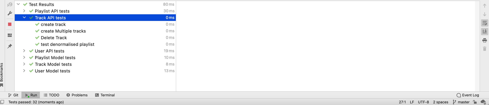

# Tracks

Following a similar methodology from the last few steps, this is a skeleton of the track api:

### track-api.js

~~~javascript
import Boom from "@hapi/boom";
import { db } from "../models/db.js";

export const trackApi = {
  find: {
    auth: false,
    handler: async function (request, h) {
    },
  },

  findOne: {
    auth: false,
    async handler(request) {
    },
  },

  create: {
    auth: false,
    handler: async function (request, h) {
    },
  },

  deleteAll: {
    auth: false,
    handler: async function (request, h) {
    },
  },

  deleteOne: {
    auth: false,
    handler: async function (request, h) {
    },
  },
};
~~~

These are the additional routes:

### api-routes.js

~~~javascript
  { method: "GET", path: "/api/tracks", config: trackApi.find },
  { method: "GET", path: "/api/tracks/{id}", config: trackApi.findOne },
  { method: "POST", path: "/api/playlists/{id}/tracks", config: trackApi.create },
  { method: "DELETE", path: "/api/tracks", config: trackApi.deleteAll },
  { method: "DELETE", path: "/api/tracks/{id}", config: trackApi.deleteOne },
~~~

... and the test skeleton:

### track-api-test.js

~~~javascript
import { assert } from "chai";
import { assertSubset } from "../test-utils.js";
import { playtimeService } from "./playtime-service.js";
import { maggie, mozart, testPlaylists, testTracks, concerto } from "../fixtures.js";

suite("Track API tests", () => {
  let user = null;
  let beethovenSonatas = null;

  setup(async () => {
  });

  teardown(async () => {});

  test("create track", async () => {
  });

  test("create Multiple tracks", async () => {
  });

  test("Delete Track", async () => {
  });

  test("test denormalised playlist", async () => {
  });
});
~~~

These should too all pass:

Remember, as that is passing is the scaffolding, there are no actual tests yet.
