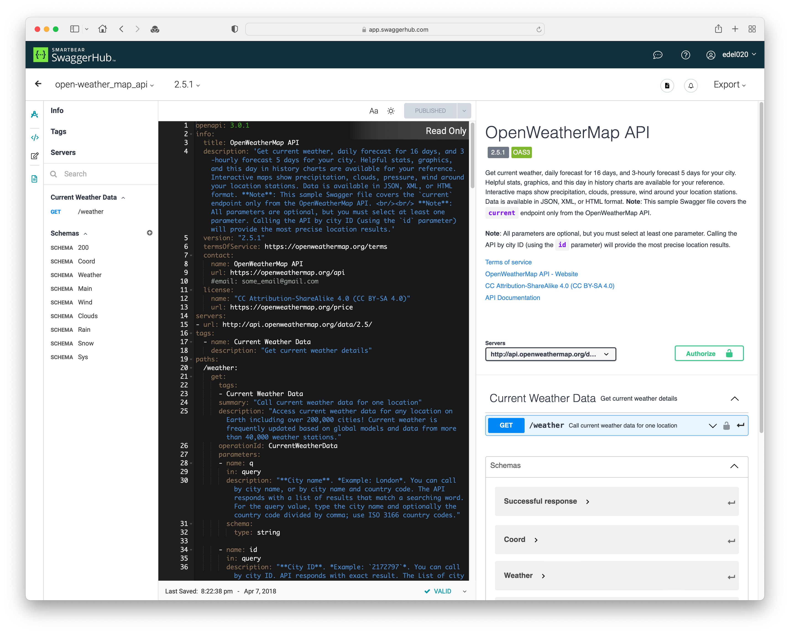
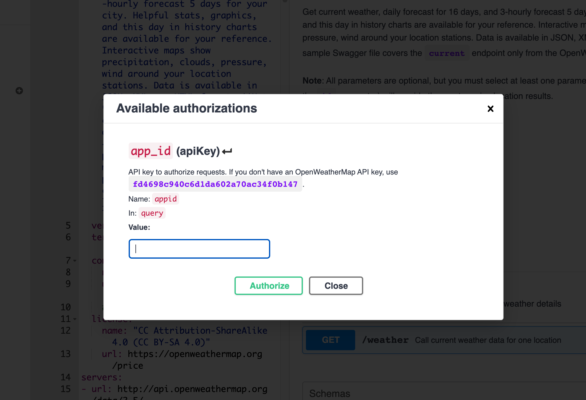
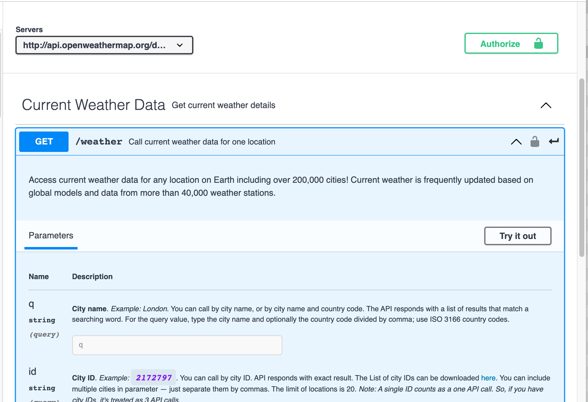
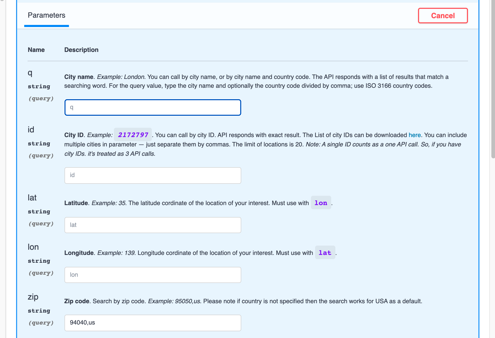
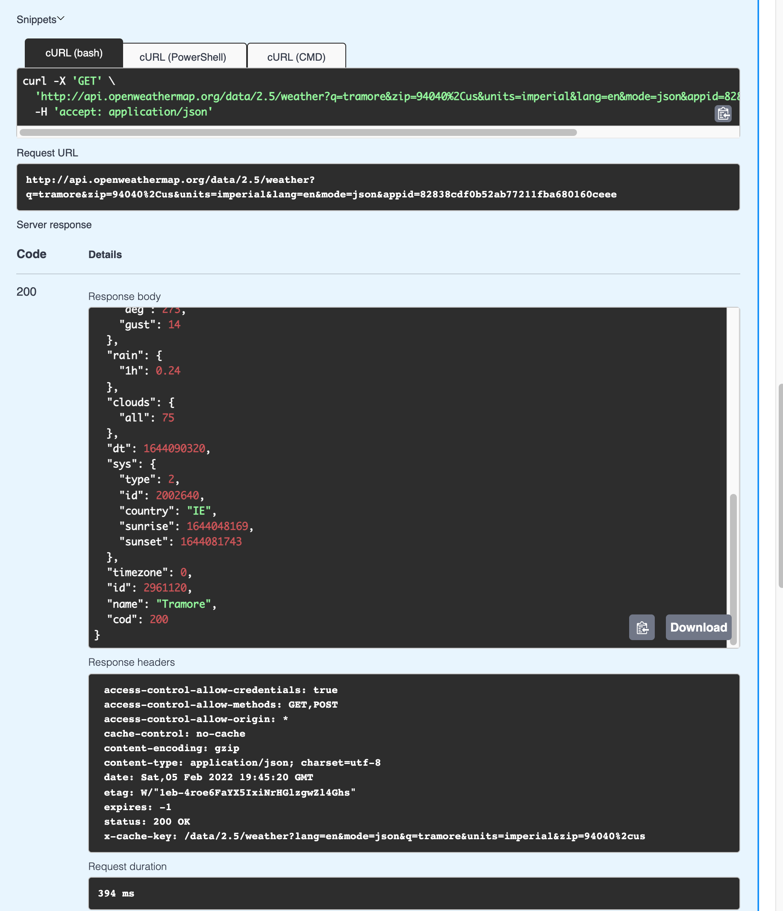

# Open API

Currently our API is undocumented. We could choose to document it according to our own style. However, there is a standard for API documentation that is widely accepted:

- <https://www.openapis.org/>

The specification is designed to be 'machine readable' - i.e. it is expressed formally such that it can be amenable to automation, accessed by various tools, registries and code generators. 

This is the starting point for exploring the standard:

- <https://oai.github.io/Documentation/specification-structure.html>

As you can see, it support JSON or YAML to express the API structure.

### Swagger

The OpenAPI specification emerged from this service:

- <https://swagger.io/>

Which is now a commercial service + a registry. It also provides a set of open source tools:

- <https://swagger.io/tools/swagger-codegen/>

Try the SwaggerHub as an experiment:

- <https://swagger.io/tools/swaggerhub/>

You can sign in with your GitHub account. This is a general overview of the service: 

- <https://support.smartbear.com/swaggerhub/docs/about.html>

Once logged in, you can search for API specs:

- <https://app.swaggerhub.com/search>

### OpenWeatherMap

OpenWeatherMap is a public Weather Service:

- <https://openweathermap.org/>

Although the API provided by this service has its own documentation:

- <https://openweathermap.org/current>

There are various versions of this captured formally on swagger hub:

- <https://app.swaggerhub.com/search?query=openweathermap&sort=BEST_MATCH&order=DESC>

Try this one:

- <https://app.swaggerhub.com/apis/IdRatherBeWriting/open-weather_map_api/2.5.1#/>

To get this to work, you will need to sign up on the OpenWeatherMap site for an API Key. Then press `authoritize` button and paste in your key:

Try the GET endpoint:

Enter your **Cite name**

... and then press **Execute**:

If your API key is valid, then the Response Body should be the current weather as requested.
