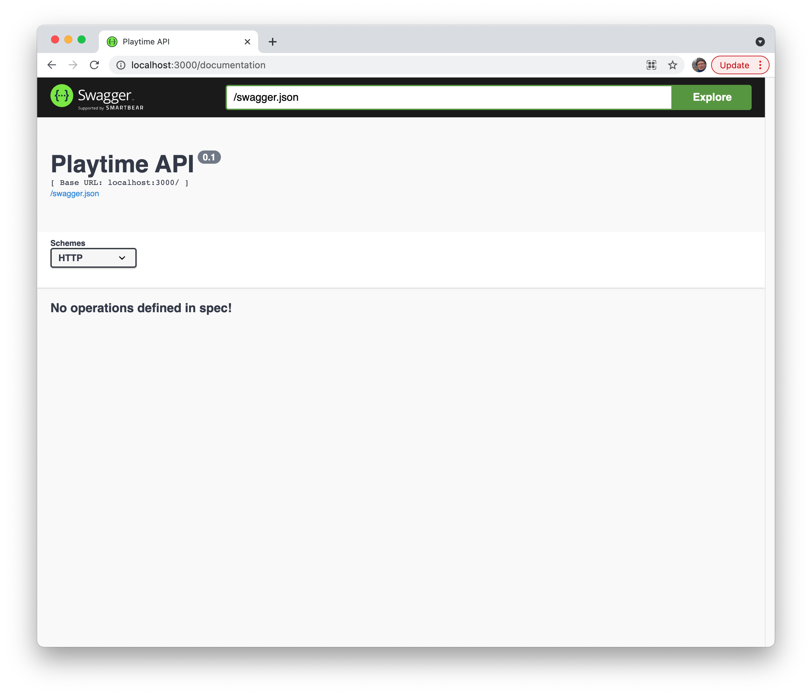

# Hapi Swagger

We can manually create the metadata to document our API to support Swagger/OpenAPI standards. However, Hapi has a plugin for this purpose:

- https://github.com/glennjones/hapi-swagger

This will enable us to annotate our HAPI endpoints with additional information, and the plugin will generate the appropriate metadata conformant with Swagger/OpenAPI. It all works with Vision + Inert,  which we already have installed.

First install the module

~~~bash
npm install hapi-swagger
~~~

In server, somewhere before the init function, define some options:

### server.js

~~~javascript
import HapiSwagger from "hapi-swagger";

const swaggerOptions = {
  info: {
    title: "Playtime API",
    version: "0.1",
  },
};
~~~

Then, after the other plugins have been initialised:

~~~javascript
  await server.register([
    Inert,
    Vision,
    {
      plugin: HapiSwagger,
      options: swaggerOptions,
    },
  ]);
~~~

Run the app, and it should support a new service:

- <http://localhost:3000/documentation>

Currently we have no API defined. This time, make sure you are running the app with:

~~~bash
npm run dev
~~~

... as this will launch with nodemon, so any changes we make in the next few steps will be automatically reloaded as we refresh the documentation page.

