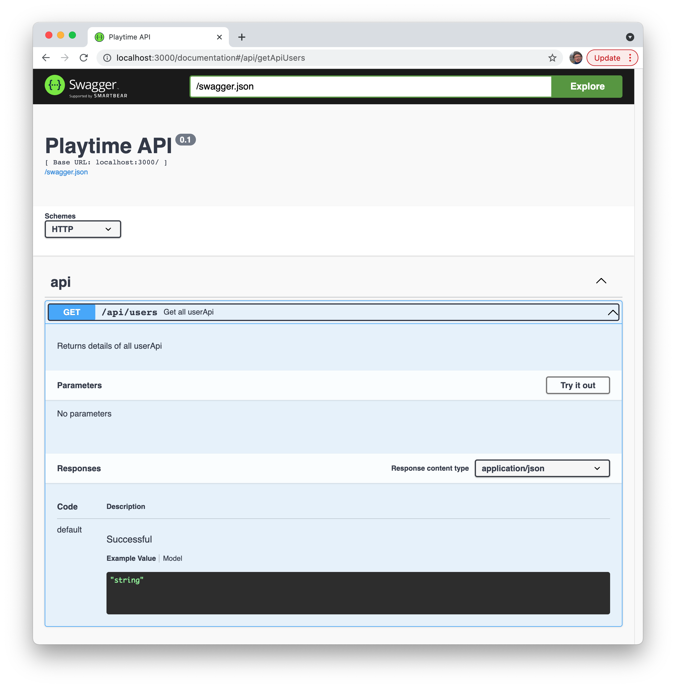
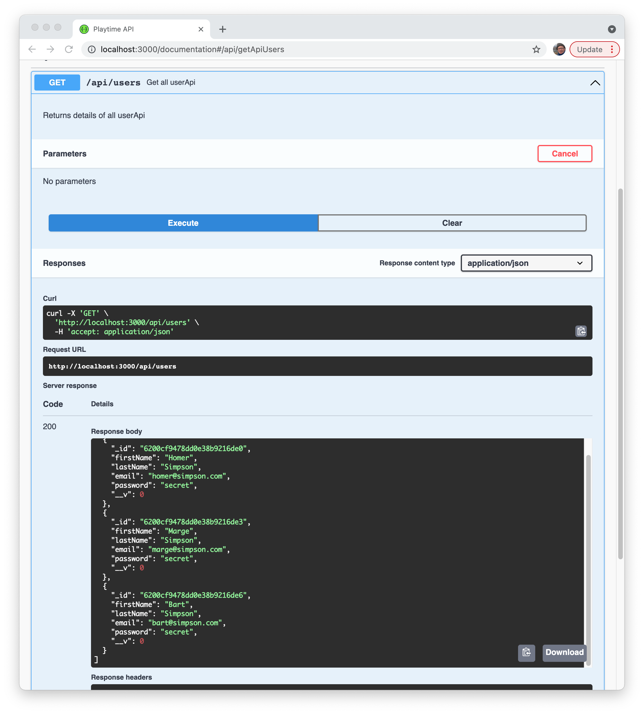
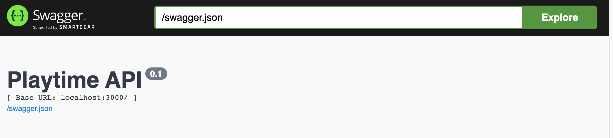
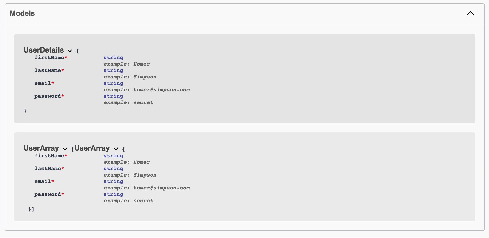
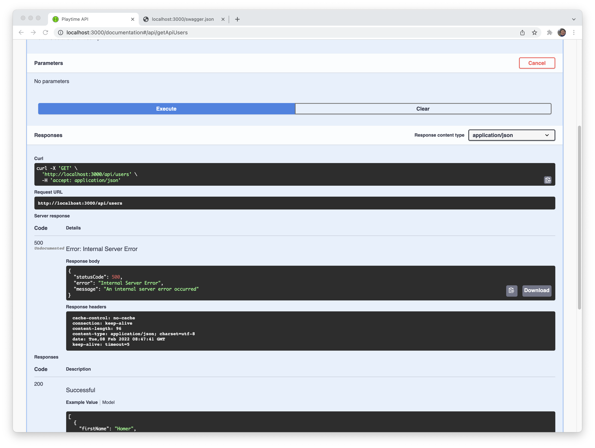

# Users API

Start by annotating the userApi.find method:

### user-api.js

~~~javascript
export const userApi = {
  find: {
    auth: false,
    handler: async function(request, h) {
      try {
        const users = await db.userStore.getAllUsers();
        return users;
      } catch (err) {
        return Boom.serverUnavailable("Database Error");
      }
    },
    tags: ["api"],
    description: "Get all userApi",
    notes: "Returns details of all userApi",
  },
~~~

The last three lines in the above are new. Refreshing the documentation page:

- <http://localhost:3000/documentation>

The **Try it Out** button should work:

The documentation above does not describe the response in any way. Although when we press **Execute** it does work. 

### API Schema

The documentation site has a link to **swagger.json**:

If you click on it, you will see the API Schema, generated by swagger:

~~~javascript
// 20220208081222
// http://localhost:3000/swagger.json

{
  "swagger": "2.0",
  "host": "localhost:3000",
  "basePath": "/",
  "schemes": [
    "http"
  ],
  "info": {
    "title": "Playtime API",
    "version": "0.1"
  },
  "tags": [
    
  ],
  "paths": {
    "/api/users": {
      "get": {
        "summary": "Get all userApi",
        "operationId": "getApiUsers",
        "description": "Returns details of all userApi",
        "tags": [
          "api"
        ],
        "responses": {
          "default": {
            "schema": {
              "type": "string"
            },
            "description": "Successful"
          }
        }
      }
    }
  },
  "definitions": {
    
  }
}
~~~

This document adheres to Version 2 of the standard:

- <https://swagger.io/specification/v2/>

## Joi / Swagger

With the Hapi-swagger plugin, we can further decorate the generated schema with request and response details, harvested from Joi validation schemas. As we have already built some of these, this offers a useful route into to generating more comprehensive API specifications.

Starting with the endpoint above, we can enhance our Joi Schemas to document the response from the request. We already have the **UserSpec**

###  joi-schemas.js

~~~javascript
export const UserSpec = {
  firstName: Joi.string().required(),
  lastName: Joi.string().required(),
  email: Joi.string().email().required(),
  password: Joi.string().required(),
};
~~~

Beow is an enhancement of the above:

~~~javascript
export const UserSpec = Joi.object()
  .keys({
    firstName: Joi.string().example("Homer").required(),
    lastName: Joi.string().example("Simpson").required(),
    email: Joi.string().email().example("homer@simpson.com").required(),
    password: Joi.string().example("secret").required(),
  })
  .label("UserDetails");

export const UserArray = Joi.array().items(UserSpec).label("UserArray");
~~~

The structure has been revised to support example data (for the documentation), labels + a new **UserArray** object to model an array of users.

We can now modify the API controller to validate the response:

~~~javascript
export const userApi = {
  find: {
    auth: false,
    handler: async function(request, h) {
      try {
        const users = await db.userStore.getAllUsers();
        return users;
      } catch (err) {
        return Boom.serverUnavailable("Database Error");
      }
    },
    tags: ["api"],
    description: "Get all userApi",
    notes: "Returns details of all userApi",
    response: { schema: UserArray }
  },
~~~

Note the extra **response** field.

When we reload the documentation site there is an additional **Models** section:

This Models panel echoes the UserSpec and UserArray schemas. These are also defined in swagger.json

~~~javascript
// 20220218094916
// http://localhost:3000/swagger.json

{
  "swagger": "2.0",
  "host": "localhost:3000",
  "basePath": "/",
  "schemes": [
    "http"
  ],
  "info": {
    "title": "Playtime API",
    "version": "0.1"
  },
  "tags": [
    
  ],
  "paths": {
    "/api/users": {
      "get": {
        "summary": "Get all userApi",
        "operationId": "getApiUsers",
        "description": "Returns details of all userApi",
        "tags": [
          "api"
        ],
        "responses": {
          "200": {
            "schema": {
              "$ref": "#/definitions/UserArray"
            },
            "description": "Successful"
          }
        }
      }
    }
  },
  "definitions": {
    "UserDetails": {
      "type": "object",
      "properties": {
        "firstName": {
          "type": "string",
          "example": "Homer"
        },
        "lastName": {
          "type": "string",
          "example": "Simpson"
        },
        "email": {
          "type": "string",
          "example": "homer@simpson.com",
          "x-format": {
            "email": true
          }
        },
        "password": {
          "type": "string",
          "example": "secret"
        },
        "_id": {
          "type": "string",
          "x-alternatives": [
            {
              "type": "string"
            },
            {
              "$ref": "#/x-alt-definitions/_id"
            }
          ]
        },
        "__v": {
          "type": "number"
        }
      },
      "required": [
        "firstName",
        "lastName",
        "email",
        "password"
      ]
    },
    "UserArray": {
      "type": "array",
      "items": {
        "$ref": "#/definitions/UserDetails"
      }
    }
  },
  "x-alt-definitions": {
    "_id": {
      "type": "object"
    }
  }
}
~~~

However, if we try it out now:

... we get an error. This is a Validation error generated from the Joi validation system. We will explore this error further (and fix) in the next step.