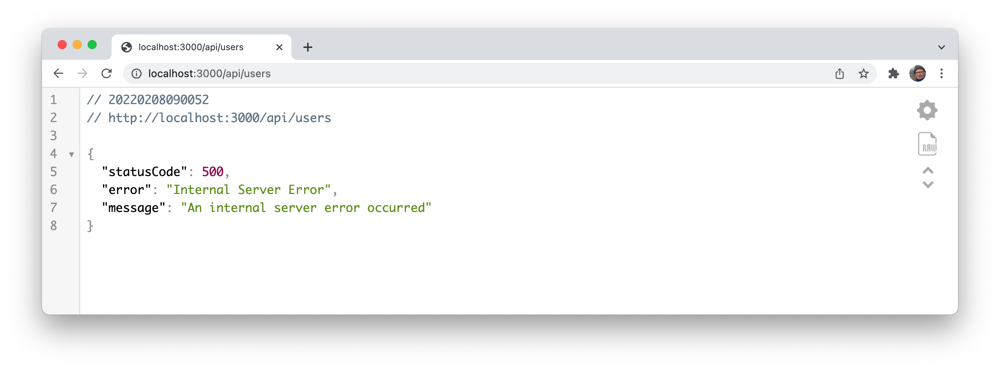

# API Validation

This is the annotated users endpoint:

### user-api.js

~~~javascript
import { UserArray } from "../models/joi-schemas.js";
...
export const userApi = {
  find: {
    auth: false,
    handler: async function(request, h) {
      try {
        const users = await db.userStore.getAllUsers();
        return users;
      } catch (err) {
        return Boom.serverUnavailable("Database Error");
      }
    },
    tags: ["api"],
    description: "Get all userApi",
    notes: "Returns details of all userApi",
    response: { schema: UserArray },
  },
  ...
~~~

It relies on these Joi Schemas:

~~~javascript
export const UserSpec = Joi.object()
  .keys({
    firstName: Joi.string().example("Homer").required(),
    lastName: Joi.string().example("Simpson").required(),
    email: Joi.string().email().example("homer@simpson.com").required(),
    password: Joi.string().example("secret").required(),
  })
  .label("UserDetails");

export const UserArray = Joi.array().items(UserSpec).label("UserArray");
~~~

However, request generates this error:

The error is generated from the Joi validation system - it is applying the Joi rules as we have been doing for form validation, except this time we are validating the output rather than the input. 

Introduce this error logging function:

### logger.js

~~~javascript
export function validationError(request, h, error) {
  console.log(error.message);
}
~~~

Change the userApi find response to include the schema + a validation function:

### user-api.js

~~~javascript
import { validationError } from "./logger.js";
....

    response: { schema: UserArray, failAction: validationError },
~~~

Now try the endpoint again, and monitor the console:

~~~bash
"[0]._id" is not allowed
~~~

Recall from our tests, that **_id** (and **__v** for mongo) are generated by our stores. Here is a revised UserSpec schema:

~~~javascript
export const IdSpec = Joi.alternatives().try(Joi.string(), Joi.object()).description("a valid ID");
                                                                                     
export const UserSpec = Joi.object()
  .keys({
    firstName: Joi.string().example("Homer").required(),
    lastName: Joi.string().example("Simpson").required(),
    email: Joi.string().email().example("homer@simpson.com").required(),
    password: Joi.string().example("secret").required(),
    _id: IdSpec,
    __v: Joi.number(),
  })
  .label("UserDetails");
~~~

This has additional definition **IdSpec**, and we are using this and a standard string in the UserSpec. Try the request now - it should work correctly.

Output validation is outlined in more detail here:

- <https://hapi.dev/tutorials/validation>

There is a weakness with this approach - as UserSpec is also used as an input specification in our application. We will deal with this in a subsequent lab.

