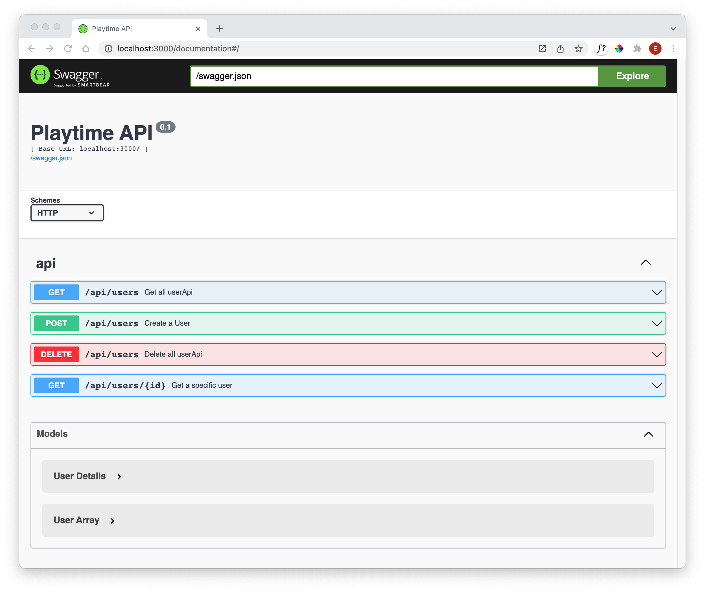

## User API Validation

We can resume our tests now to see if everything is in order:

~~~bash
npm run test
~~~

~~~bash
> playtime@0.7.0 test
> ./node_modules/mocha/bin/mocha --ui tdd test/**/*.js

  Playlist API tests
    ✔ create playlist
    ✔ delete a playlist
    ✔ create multiple playlists
    ✔ remove non-existant playlist

  Track API tests
    ✔ create track
    ✔ create Multiple tracks
    ✔ Delete TrackApi
    ✔ denormalised playlist
    
   User API tests
    ✔ create a user
    ✔ delete all userApi
    ✔ get a user
    ✔ get a user - bad id
    ✔ get a user - deleted user

  Playlist Model tests
    ✔ create a playlist
    ✔ delete all playlists
    ✔ get a playlist - success
    ✔ delete One Playist - success
    ✔ get a playlist - bad params
    ✔ delete One Playlist - fail
    
  Track Model tests
    ✔ create single track
    ✔ create multiple trackApi
    ✔ delete all trackApi
    ✔ get a track - success
    ✔ delete One Track - success
    ✔ get a playlist - bad params
    ✔ delete One User - fail
    
  User Model tests
    ✔ create a user
    ✔ delete all userApi
    ✔ get a user - success
    ✔ delete One User - success
    ✔ get a user - bad params
    ✔ delete One User - fail

  32 passing (356ms)

~~~

(Note: logged warnings remove from the above)

Extending our API annotations to the findOne endpoint:

### users-api.js

~~~javascript
import { UserSpec, UserArray } from "../models/joi-schemas.js";
...
  findOne: {
    auth: false,
    handler: async function (request, h) {
      try {
        const user = await db.userStore.getUserById(request.params.id);
        if (!user) {
          return Boom.notFound("No User with this id");
        }
        return user;
      } catch (err) {
        return Boom.serverUnavailable("No User with this id");
      }
    },
    tags: ["api"],
    description: "Get a specific user",
    notes: "Returns user details",
    response: { schema: UserSpec, failAction: validationError },
  },
~~~

Verify that the tests still all pass - and check the documentation site that we have this endpoint now also documented:

We can also extend the validation to API inputs - in the case of findOne, we have a parameter expected:

~~~javascript
    validate: { params: { id: IdSpec }, failAction: validationError },
~~~

Here are the remaining user endpoints with swagger annotations:

~~~javascript
  create: {
    auth: false,
    handler: async function(request, h) {
      try {
        const user = await db.userStore.addUser(request.payload);
        if (user) {
          return h.response(user).code(201);
        }
        return Boom.badImplementation("error creating user");
      } catch (err) {
        return Boom.serverUnavailable("Database Error");
      }
    },
    tags: ["api"],
    description: "Create a User",
    notes: "Returns the newly created user",
    validate: { payload: UserSpec, failAction: validationError },
    response: { schema: UserSpec, failAction: validationError },
  },

  deleteAll: {
    auth: false,
    handler: async function(request, h) {
      try {
        await db.userStore.deleteAll();
        return h.response().code(204);
      } catch (err) {
        return Boom.serverUnavailable("Database Error");
      }
    },
    tags: ["api"],
    description: "Delete all userApi",
    notes: "All userApi removed from Playtime",
  },
~~~

We now have a complete documentation for the users endpoints:

Make sure all the tests still pass.

